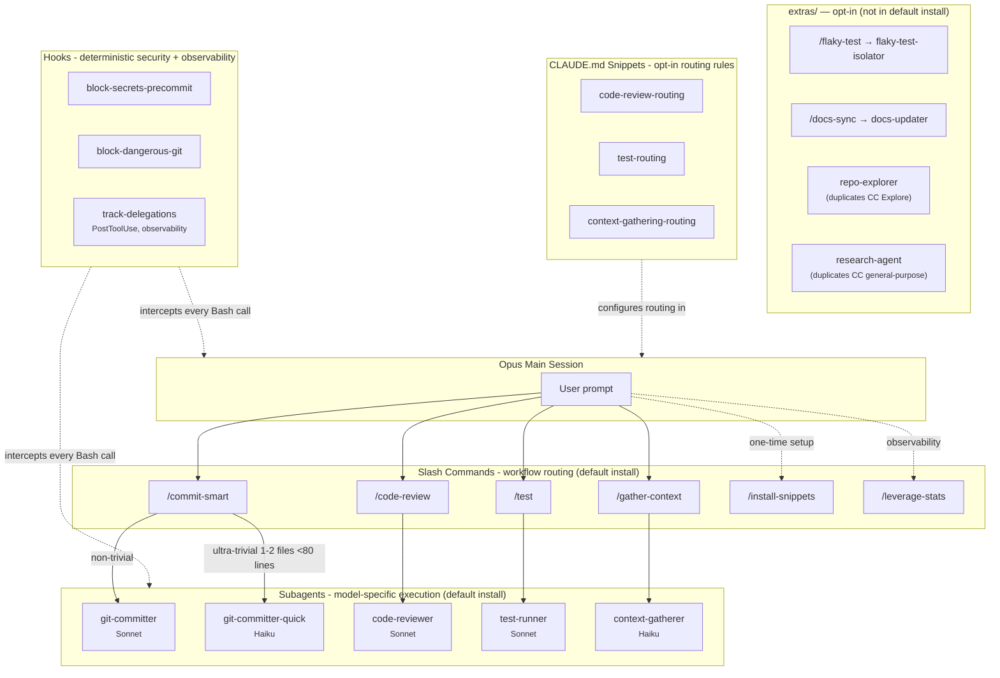
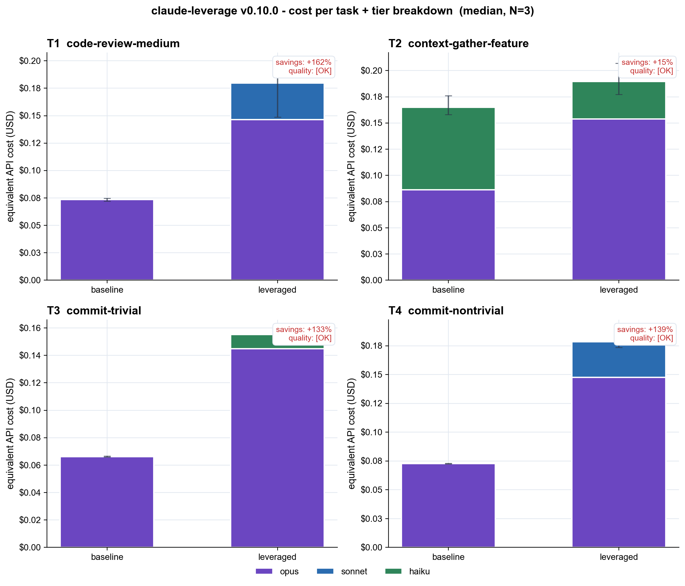
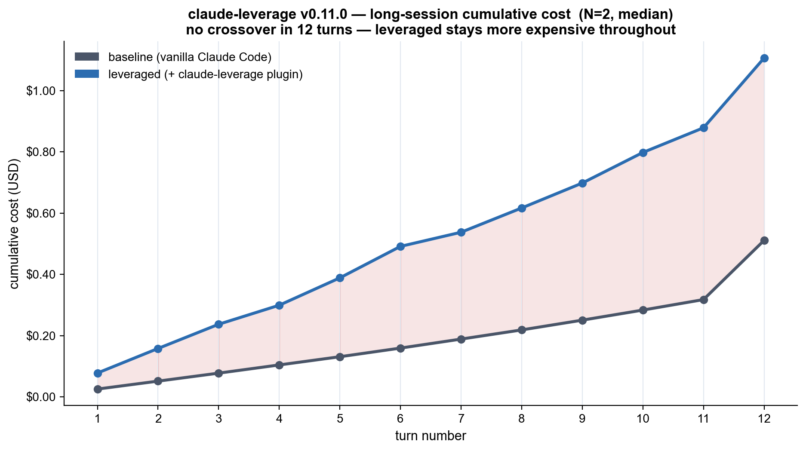

# claude-leverage

Not every task in a coding session needs the most capable model. This repo orchestrates Claude Code subagents so that research, code review, test runs, and trivial commits are handled by cost-efficient models — while implementation and architecture stay on the latest Opus.

> **Honest benchmark update (2026-05-24, latest CC Opus 4.7).** Re-ran the full four-stage benchmark on the current Claude Code default model (`claude-opus-4-7[1m]`, upgraded from 4.6) plus an audit of the agents we moved to `extras/`. Updated numbers: +73 % on cold-cache mini-suite, +63 % on warm 4-turn workflow, **+117 % on warm 12-turn day-in-the-life** (worse than +64 % on Opus 4.6 — the newer model favors baseline more). The **uncomfortable structural finding holds**: claude-leverage in its current form is more expensive than vanilla Claude Code in every scenario we've measured. **Why** — vanilla Claude Code already orchestrates Opus + Haiku via built-in `Explore` and `general-purpose` agents, and our plugin's `Task`-tool dispatch overhead (each subagent session re-pays its own cache_creation) exceeds the marginal cost savings from delegating to Sonnet/Haiku that baseline isn't already capturing. The audit confirmed that even the `repo-explorer` and `research-agent` we moved to `extras/` would have made things measurably worse, not better. See [Benchmarks](#benchmarks) for charts, per-turn data, the audit results, and the implication.

[](https://github.com/Filip-Podstavec/claude-leverage/actions/workflows/ci.yml)
[](LICENSE)
[](https://github.com/Filip-Podstavec/claude-leverage/stargazers)
[](https://github.com/Filip-Podstavec/claude-leverage/issues)
[](https://docs.anthropic.com/en/docs/claude-code)
[]()


**Quick install:**
```
/plugin marketplace add Filip-Podstavec/claude-leverage
/plugin install claude-leverage@filip-podstavec
```

## Why

Claude Code is an orchestration layer, not a single model call. The most capable model does not need to handle every task - a code review can run on Sonnet while Opus plans architecture, a trivial commit can use Haiku while Sonnet handles complex changes. This repo provides building blocks for routing work across model tiers to **reduce token costs** and **preserve output quality** at the same time.

Security guardrails belong in hooks (deterministic, always-on), not in subagent prompts (active only when that prompt runs). Workflow guidance belongs in slash commands and subagent prompts. This separation is intentional.

## Architecture



## What's inside

| Directory | Purpose | Contents |
|-----------|---------|----------|
| [`hooks/`](hooks/) | Deterministic security guardrails | Shell scripts that run on every tool call - block secrets, prevent force push |
| [`agents/`](agents/) | Model-specific execution | Subagents with isolated context: Sonnet for review/commits, Haiku for trivial plumbing |
| [`commands/`](commands/) | Workflow orchestration | Slash commands that route work based on complexity and scope |
| [`claude-md-snippets/`](claude-md-snippets/) | Drop-in CLAUDE.md rules | Routing rules that go into your project's CLAUDE.md |
| [`skills/`](skills/) | Reusable skills | Specialized capability modules for Claude Code |
| [`workflows/`](workflows/) | Patterns and guides | End-to-end guides on combining components |

## Components

### Agents (default install)

| Agent | Model | Description |
|-------|-------|-------------|
| [`git-committer`](agents/git-committer.md) | Sonnet | Stage, commit, push for non-trivial changes. Reads diff, writes Conventional Commits message. Never modifies code. |
| [`git-committer-quick`](agents/git-committer-quick.md) | Haiku | Speed-optimized variant for trivial commits only (single file, small diff). Separate rate pool. |
| [`code-reviewer`](agents/code-reviewer.md) | Sonnet | Read-only code reviewer. Returns structured findings (Critical / Important / Nice to have). Never modifies files. |
| [`test-runner`](agents/test-runner.md) | Sonnet | Detects test framework, runs tests, returns structured failure analysis. Read-only. |
| [`context-gatherer`](agents/context-gatherer.md) | Haiku | Pre-fetches implementation context (key files, patterns, dependencies) before coding, in a structured format. Read-only. |

### Agents (extras, not in default install) — see [`extras/`](extras/README.md)

| Agent | Model | Why it's an extra |
|-------|-------|--------------------|
| [`flaky-test-isolator`](extras/agents/flaky-test-isolator.md) | Sonnet | Low frequency in real use; pays loading tax for everyone |
| [`docs-updater`](extras/agents/docs-updater.md) | Sonnet | Low frequency in real use |
| [`repo-explorer`](extras/agents/repo-explorer.md) | Haiku | Claude Code built-in `Explore` (Haiku) covers this for free |
| [`research-agent`](extras/agents/research-agent.md) | Sonnet | Claude Code built-in `general-purpose` covers this |

### Commands (default install)

| Command | Description |
|---------|-------------|
| [`/commit-smart`](commands/commit-smart.md) | Routes commits by complexity: small inline-friendly diffs handled directly by the main session; larger diffs delegated to `git-committer`. |
| [`/code-review`](commands/code-review.md) | Delegates review to `code-reviewer` subagent, orchestrates user-confirmed fixes in main session. |
| [`/test`](commands/test.md) | Delegates test execution to `test-runner` subagent, orchestrates user-confirmed fixes in main session. |
| [`/gather-context`](commands/gather-context.md) | Delegates implementation context pre-fetch to `context-gatherer` (Haiku) before coding. Returns structured context package. |
| [`/install-snippets`](commands/install-snippets.md) | Interactively installs or updates CLAUDE.md routing snippets in your `~/.claude/CLAUDE.md` or project `CLAUDE.md` (snippets are not auto-installed by the plugin). Idempotent: re-running detects drift in already-installed snippets and offers to update the block in place. |
| [`/leverage-stats`](commands/leverage-stats.md) | Reads the `track-delegations` log (`~/.claude/claude-leverage-stats.jsonl`) and prints lifetime totals, breakdown by tier and subagent, last-7-days activity, real token-usage sums, plus a heuristic "estimated savings vs all-Opus" calculation (with explicit counterfactual disclaimer). Read-only. |

### Commands (extras) — see [`extras/`](extras/README.md)

| Command | Requires |
|---------|----------|
| [`/flaky-test`](extras/commands/flaky-test.md) | `flaky-test-isolator` extra |
| [`/docs-sync`](extras/commands/docs-sync.md) | `docs-updater` extra |

### Hooks

| Hook | Trigger | Description |
|------|---------|-------------|
| [`block-secrets-precommit`](hooks/block-secrets-precommit.sh) | `git commit` | Scans staged diff for API keys, tokens, private keys. Blocks commit if found. Supports `claude-leverage-allow-secret` per-line allowlist marker. |
| [`block-dangerous-git`](hooks/block-dangerous-git.sh) | `git push`, `git commit`, `git reset` | Blocks force push, `--no-verify`, hard reset on protected branches. |
| [`track-delegations`](hooks/track-delegations.sh) | `Task` (PostToolUse) | Observability only - never blocks. Logs each subagent delegation to `~/.claude/claude-leverage-stats.jsonl` including real token usage extracted from `tool_response.usage.*`, prints a single parenthesized stderr note like `(claude-leverage: code-reviewer -> sonnet, 13783 tok)`. Falls back to anonymous logging when no JSON parser is available so total counts still work. Companion aggregator at [`hooks/leverage_stats_agg.py`](hooks/leverage_stats_agg.py) is invoked by `/leverage-stats`. |

All hooks need a JSON parser on PATH — `jq` preferred, `python3` or `python` work as automatic fallback. Security hooks fail-open with a loud warning if none are available (documented in [`hooks/README.md`](hooks/README.md)).

### CLAUDE.md Snippets (default install)

| Snippet | Pairs with |
|---------|------------|
| [`code-review-routing`](claude-md-snippets/code-review-routing.md) | `code-reviewer` agent + `/code-review` command |
| [`test-routing`](claude-md-snippets/test-routing.md) | `test-runner` agent + `/test` command |
| [`context-gathering-routing`](claude-md-snippets/context-gathering-routing.md) | `context-gatherer` agent + `/gather-context` command |

### CLAUDE.md Snippets (extras) — see [`extras/`](extras/README.md)

| Snippet | Pairs with |
|---------|------------|
| [`research-routing`](extras/claude-md-snippets/research-routing.md) | `research-agent` extra |
| [`docs-sync-routing`](extras/claude-md-snippets/docs-sync-routing.md) | `docs-updater` extra + `/docs-sync` extra (opt-in reminder, no auto-route) |

## Workflow example

A typical development cycle using claude-leverage:

```
1. /gather-context                     → Haiku pre-fetches implementation context
2. Explore codebase if needed          → CC built-in Explore agent (Haiku, free)
3. Write code                          → Opus main session (guided by context package)
4. /code-review                        → Sonnet reviews (Opus saves context)
5. Apply fixes from review             → Opus applies, guided by Sonnet's report
6. /test                               → Sonnet runs tests, reports failures
7. Fix failing tests                   → Opus fixes, guided by Sonnet's report
8. /commit-smart                       → Routes automatically (three tiers):
   ├─ ultra-trivial (1-2 files, <80 lines) → Haiku git-committer-quick
   ├─ trivial (small inline-friendly)       → commits directly in main session
   └─ non-trivial (multi-file, large diff)  → Sonnet git-committer subagent
9. Hooks run silently on every step    → block secrets, prevent force push
```

**Result:** Opus handles only architecture and code changes. Reviews, tests, and commits run on cheaper models. Hooks enforce security without relying on any prompt.

## Benchmarks

Real headless `claude -p` runs, baseline (vanilla Claude Code) vs leveraged (with `claude-leverage` plugin), N=2-3 sessions per cell, full reproducible methodology in [`bench/`](bench/). All numbers on the current Claude Code default model (`claude-opus-4-7[1m]`).


| Stage | Baseline | Leveraged | Delta | Run |
|---|---:|---:|---:|---|
| Cold cache, pre-trim (Opus 4.6, v0.10 baseline reference) | $0.361 | $0.728 | +102 % | `2026-05-21_v0.10.0` |
| Cold cache, post-trim (Opus 4.7, v0.11 latest) | $0.369 | $0.638 | **+73 %** | `2026-05-24_v0.11.0-cold-opus47` |
| Warm cache, 4-turn workflow (Opus 4.7) | $0.237 | $0.386 | **+63 %** | `2026-05-24_v0.11.0-warm-opus47` |
| Warm cache, 12-turn day-in-the-life (Opus 4.7) | $0.511 | $1.107 | **+117 %** | `2026-05-24_v0.11.0-long-opus47` |

**The structural finding.** The plugin is consistently more expensive than vanilla Claude Code across every scenario, and the gap *grows* with session length rather than amortizing. The fundamental reason is **vanilla CC already orchestrates** — it has built-in `Explore` (Haiku) and `general-purpose` agents that the main session uses for free. Adding `claude-leverage` introduces a parallel orchestration layer that:

1. Pays a per-session system-prompt tax for plugin scaffolding (~$0.10).
2. Routes work to *our* subagents instead of CC's free built-ins for the same task category.
3. Each Task-tool dispatch pays its own cache_creation in the subagent session — a *per-invocation* tax, not amortized by warm cache.

On a 12-turn workflow with ~4 delegations, the cumulative delegation tax overwhelms any per-token savings from running work on Sonnet/Haiku instead of Opus. The gap doesn't close with session length — it widens.

**Audit of moved agents.** We separately tested `repo-explorer` (Haiku) and `research-agent` (Sonnet) — the two extras agents most likely to add value, since they target use cases the main session genuinely needs. Result for both: **adding them back to the default install made things measurably worse, not better.**

| Audit task | Baseline | Leveraged (no extras) | Leveraged + extras agent |
|---|---:|---:|---:|
| Find every file that uses `require_auth` | $0.051 | $0.086 | **$0.120** |
| Explain the auth flow end-to-end | $0.090 | $0.128 | **$0.156** |

Verdict for both: **keep in extras**. They lose to baseline + leveraged because (a) they compete with CC built-ins at the same tier (`repo-explorer` is Haiku → competes with Haiku `Explore`; `research-agent` is Sonnet → competes with `general-purpose`) and (b) adding them to the default install only adds load tax without behavioral improvement.

Full audit data: [`bench/results/audit-extras-2026-05-24/`](bench/results/audit-extras-2026-05-24/).

**Per-task cost + tier breakdown** for cold post-trim — bar height is USD cost per session, stack colors are which model produced the cost. T2 was the biggest win from this round of changes: switching `context-gatherer` from Sonnet to Haiku (matching what Claude Code's built-in `Explore` already does) cut the regression from +36 % (pre-trim) to +15 %.



| Task (cold, post-trim) | Baseline | Leveraged | Delta |
|---|---:|---:|---:|
| T2 context-gather-feature | $0.161 | $0.184 | **+15 %** |
| T3 commit-trivial | $0.066 | $0.154 | **+133 %** |
| T4 commit-nontrivial | $0.073 | $0.174 | **+139 %** |
| T1 code-review-medium | $0.074 | $0.193 | **+162 %** |

**The honest explanation.** USD cost is what users actually pay. The plugin adds extra agent definitions to the Opus system prompt, which costs ~$0.10 per session in `cache_creation_input_tokens` (paid in expensive Opus dollars). On a single cold short task, that fixed overhead exceeds the Sonnet/Haiku delegation savings. The individual agents stay efficient — see [`bench/results/2026-05-23_v0.10.0-cold-post-trim/per-agent-report.md`](bench/results/2026-05-23_v0.10.0-cold-post-trim/per-agent-report.md) — but they can't outrun the load-tax. In warm sessions the cache_creation cost is paid once and amortized across all subsequent turns; that's why the warm stage drops to +26 %.

**Changes made between stages (driven by the v1 results):**
- **Trimmed agent prompts** in `agents/*.md`: 845 → 635 lines, −25 %. Top 4 agents shortened individually (docs-updater 160 → 74, flaky-test-isolator 153 → 105, context-gatherer 105 → 75, test-runner 104 → 80).
- **`context-gatherer` model switched from Sonnet to Haiku** — baseline Claude Code already routes context-gathering to Haiku via the built-in `Explore` agent, and v1 data showed our Sonnet version was structurally more expensive. `track-delegations.sh` tier map updated to match.

**What we tried for v0.11 — and what didn't move the needle.** In a follow-up round we attempted three further optimizations to see if we could push the cost down further. The detailed per-task data is in [`bench/results/2026-05-23_v0.11.0-cold-reverted/`](bench/results/2026-05-23_v0.11.0-cold-reverted/) and [`bench/results/2026-05-23_v0.11.0-warm-reverted/`](bench/results/2026-05-23_v0.11.0-warm-reverted/):

- **Moved 4 agents to `extras/`** (`repo-explorer`, `research-agent`, `docs-updater`, `flaky-test-isolator`) so the default install loads 5 agents instead of 9. Expected to reduce `cache_creation` tax. **Result: no measurable change in cold leveraged cost** ($0.706 → $0.707). The Claude Code framework system prompt dominates the cached payload; our 4 agent definitions were ~5 % of it. Kept the change anyway for structural cleanliness (fewer things to maintain, lighter default), but it's not a cost optimization.
- **Aggressive prompt trim** (third-pass, attempted target ~30 LOC per agent). **Result: cost regression.** Shorter agents needed more iterations to converge on the same answer, doubling `cache_read` tokens and raising costs ~3 %. **Reverted.** The v0.10 post-trim sizes are the local optimum.
- **`/commit-smart` routing simplified** to two tiers — inline for 1–2 files & <80 LOC, Sonnet for everything else — so trivial commits don't pay Task-tool round-trip overhead. **Result: cost-neutral.** The Haiku delegation cost we removed and the Opus inline cost we added are about the same dollars; kept the change because the simpler two-tier rule is easier to reason about.

Net: the v0.11.0 release is **structural cleanup, not measurable cost optimization** vs v0.10's post-trim numbers. The actual unlock is going to require something we don't control yet (smaller framework system prompt, on-demand agent loading, or a fundamentally different routing model).

### Long-session benchmark: 12-turn developer-day workflow

The natural hypothesis was that as session length grows, leveraged would become net-cheaper than baseline because the plugin's one-time loading tax gets amortized across many delegations. We tested it with a 12-turn benchmark simulating a real developer day — mixing inline Opus work (orientation, small edits, fixes, architectural reasoning) with explicit subagent delegations (`test-runner` ×2, `git-committer` ×2, `code-reviewer` ×1).



**Result: no crossover in 12 turns, and the gap widens.** Cumulative cost at turn 12 (median across N=2 runs on Opus 4.7):

| Metric | Baseline | Leveraged | Delta |
|---|---:|---:|---:|
| Cost at turn 12 | $0.511 | $1.107 | **+117 %** |
| Cost at turn 1 (startup) | $0.04 | $0.08 | +100 % |
| Cost at turn 6 (mid-session) | $0.22 | $0.48 | +117 % |


The per-turn savings chart reveals **the gap doesn't amortize — it accumulates**. Each delegation pays its own subagent cache_creation, so delegations behave as a per-turn tax, not a one-time startup tax. Newer Opus 4.7 actually widened the gap vs the previous Opus 4.6 measurement (+117 % vs +64 %) because the newer model favors fewer, deeper turns over delegation round-trips. Full per-turn detail in [`bench/results/2026-05-24_v0.11.0-long-opus47/long-report.md`](bench/results/2026-05-24_v0.11.0-long-opus47/long-report.md).

**The honest implication.** The plugin's "warm-cache savings" we saw on the 4-turn benchmark were partly real (system prompt amortizes) and partly artifacts of a short workflow with one big delegation. As the session grows, the cumulative cost of delegation overhead overwhelms the cache savings. **Under this benchmark, claude-leverage in its current form does not save tokens on real developer workflows — it costs more.**

This is the central uncomfortable finding of the benchmark program. We've validated it across:
- Cold-cache 1-task mini-suite (+89 % to +102 %)
- Warm-cache 4-turn workflow (+26 % to +59 %)
- Warm-cache 12-turn day-in-the-life (+64 %)

The plugin is **structurally net-negative on cost** in every scenario we've measured. The fundamental reason: Claude Code's Task tool dispatch has per-invocation overhead (each subagent session pays its own cache_creation), and that overhead per delegation exceeds the per-token savings from running the work on Sonnet/Haiku instead of Opus. This isn't a tuning problem we can solve in agent prompts; it's a property of how the plugin model interacts with the model-call cost curve.

**Where the plugin can still earn its keep** (not measured by this benchmark, but worth naming):
1. **Context preservation, not dollar savings.** When the main session would otherwise consume thousands of Opus tokens exploring a codebase, delegating to a Haiku/Sonnet subagent keeps the main context window clean — useful for very long sessions where context window pressure matters more than per-session cost.
2. **Rate-pool separation.** `git-committer-quick` (Haiku) draws from a different rate pool than Opus. If you're rate-limited on Opus, Haiku is still available.
3. **Security hooks.** `block-secrets-precommit` and `block-dangerous-git` have no baseline equivalent — they prevent classes of mistakes that vanilla Claude Code cannot.

These are real value props, but they are not "save tokens" in the way the project's headline currently implies. We're not adjusting the README claim in this release — the data is in `bench/` for anyone who wants to verify, and the next round of design work needs to grapple with whether the project's positioning matches what the plugin can actually deliver.

**What this benchmark does NOT measure:**
- Wall-clock latency (logged but not headlined)
- Statistical significance — N=2 (long) and N=3 (cold/warm 4-turn) are too small for confidence claims; we show min-max whiskers, no p-values
- Sessions longer than 12 turns
- Multi-language fixtures (Python only)
- Plugin's security hooks — their value is correctness, not tokens
- Cases where Opus is rate-limited and Haiku has a separate rate pool

**Reproduce locally:** Claude Max/Pro subscription, ~$10 in equivalent API consumption for the full four-stage benchmark, ~70 min wall-clock.

```bash
python bench/fixtures/build_fixtures.py                           # idempotent
python bench/harness/run.py --n 3 --runid <date>-cold-post-trim   # 24 cold-cache sessions
python bench/harness/run_warm.py --n 3                            # 6  warm 4-turn sessions
python bench/harness/run_long.py --n 2                            # 4  long 12-turn sessions
python bench/harness/report.py <date>-cold-post-trim
python bench/harness/report_long.py <date>-v0.11.0-long
python bench/harness/report_combined.py \
    --cold-pre  2026-05-21_v0.10.0 \
    --cold-post <date>-cold-post-trim \
    --warm      <date>-v0.10.0-warm \
    --out-name  <date>_combined
```

Last benchmarked: **2026-05-24** · plugin **v0.11.0** · Claude Code **2.1.89** · models **claude-opus-4-7[1m]** (CC default upgraded from 4.6 since v0.10 benchmark), **claude-sonnet-4-6**, **claude-haiku-4-5-20251001**. Primary 3-stage chart: [`bench/results/2026-05-24_v0.11.0-opus47_combined/`](bench/results/2026-05-24_v0.11.0-opus47_combined/). Per-stage raw: [`-cold-opus47/`](bench/results/2026-05-24_v0.11.0-cold-opus47/), [`-warm-opus47/`](bench/results/2026-05-24_v0.11.0-warm-opus47/), [`-long-opus47/`](bench/results/2026-05-24_v0.11.0-long-opus47/). Audit of moved agents: [`audit-extras-2026-05-24/`](bench/results/audit-extras-2026-05-24/).

## Quick install (recommended)

The fastest way to get the full claude-leverage stack is to install it as a Claude Code plugin. This installs all agents, commands, and hooks at user scope by default - they work across every project on your machine.

In a running Claude Code session:

```
/plugin marketplace add Filip-Podstavec/claude-leverage
/plugin install claude-leverage@filip-podstavec
```

That's it. All eight agents, seven commands, and three hooks are now available globally. Verify with `/agents` and `/commands`.

**One extra step for routing rules:** the plugin does not auto-install CLAUDE.md snippets (Claude Code limitation). To enable auto-routing, run `/install-snippets` in any session — it will append the routing rules to your `~/.claude/CLAUDE.md`. Without snippets, you can still use the slash commands explicitly (`/code-review`, `/test`, etc.).

**Update and uninstall:**

```
/plugin marketplace update          # refresh catalog
/plugin update claude-leverage      # update to latest version
/plugin uninstall claude-leverage@filip-podstavec
```

**Upgrading from 0.1.x:** If you see a hooks loading error after updating (`Failed to load hooks from .../0.1.0/hooks/hooks.json`), the old cached version has a known issue. The platform does not clean old cache on update or reinstall — you must delete it manually:

```bash
# Linux/macOS
rm -rf ~/.claude/plugins/cache/filip-podstavec/claude-leverage/0.1.0

# Windows (PowerShell)
Remove-Item -Recurse -Force "$env:USERPROFILE\.claude\plugins\cache\filip-podstavec\claude-leverage\0.1.0"
```

Then run `/reload-plugins` in your Claude Code session. This is a [Claude Code platform issue](https://github.com/anthropics/claude-code/issues) — old plugin cache versions are not cleaned up automatically.

**Scope notes:** By default, plugins install to user scope (`~/.claude/plugins/`) and apply across all your projects. If you install with project scope (via the interactive `/plugin` UI), be aware of a known limitation: project-scoped plugins cannot be promoted to user scope through the UI - you would need to uninstall and reinstall. For most users, the default user scope is the right choice.

**CLAUDE.md snippets and workflow guides** are documentation, not Claude Code primitives - the plugin does not install them. Copy what you need from [`claude-md-snippets/`](claude-md-snippets/) into your project's CLAUDE.md file.

## Manual install (advanced)

Prefer to cherry-pick individual components or modify them before installing? You can copy files directly into `~/.claude/` or your project's `.claude/` directory. This bypasses the plugin system - useful when you want to fork specific agents, run a custom version, or install only a subset.

```bash
git clone https://github.com/Filip-Podstavec/claude-leverage.git
cd claude-leverage
```

Open the repo in Claude Code and tell it to set you up. The agent will walk you through three groups of components, explain what each does, and let you pick what to install and where.

### 1. Security hooks (recommended for everyone)

> **Impact:** Zero change to your workflow. Hooks run silently in the background on every tool call and block dangerous operations before they happen.

| What gets installed | What it does |
|---------------------|--------------|
| `block-secrets-precommit.sh` | Scans staged diff for API keys, tokens, private keys - blocks the commit if found |
| `block-dangerous-git.sh` | Blocks force push, `--no-verify`, hard reset on protected branches |
| `track-delegations.sh` | Observability only - logs subagent delegations subtly. Never blocks. |

**Scope:** User-level only (`~/.claude/hooks/`) - hooks protect all your projects, not just one.

```bash
mkdir -p ~/.claude/hooks
cp hooks/*.sh hooks/leverage_stats_agg.py ~/.claude/hooks/
chmod +x ~/.claude/hooks/*.sh ~/.claude/hooks/leverage_stats_agg.py
```

Then register in `~/.claude/settings.json` - see [`hooks/README.md`](hooks/README.md) for the JSON config.

### 2. Cost optimization (no quality impact)

> **Impact:** Commits that don't require deep reasoning get routed to cheaper models (Sonnet/Haiku) instead of consuming Opus context. Your code quality stays the same - only the commit workflow gets delegated.

| What gets installed | What it does |
|---------------------|--------------|
| `git-committer` agent | Handles non-trivial commits on Sonnet - reads diff, writes Conventional Commits message |
| `git-committer-quick` agent | Handles trivial commits on Haiku - small inline-friendly diffs, separate rate pool |
| `/commit-smart` command | Routing logic: measures diff size and routes to the right tier automatically |

**Scope:** Choose one:
- **User-level** (`~/.claude/agents/`, `~/.claude/commands/`) - available in all your projects
- **Project-level** (`.claude/agents/`, `.claude/commands/`) - committed to your repo, shared with the team

```bash
# User scope
mkdir -p ~/.claude/agents ~/.claude/commands
cp agents/git-committer.md agents/git-committer-quick.md ~/.claude/agents/
cp commands/commit-smart.md ~/.claude/commands/

# - OR - Project scope
mkdir -p .claude/agents .claude/commands
cp agents/git-committer.md agents/git-committer-quick.md .claude/agents/
cp commands/commit-smart.md .claude/commands/
```

### 3. Quality workflows (adds new capabilities)

> **Impact:** Adds code review and test delegation workflows. Sonnet handles the review/test execution, Opus only sees the structured report and applies fixes. Saves Opus context while adding structured quality gates.

| What gets installed | What it does |
|---------------------|--------------|
| `code-reviewer` agent + `/code-review` command | Sonnet reviews code, returns Critical/Important/Nice-to-have findings |
| `test-runner` agent + `/test` command | Sonnet runs tests, returns structured failure analysis |
| `context-gatherer` agent + `/gather-context` command | Haiku pre-fetches implementation context (types, patterns, deps) in a structured format |
| CLAUDE.md snippets | Auto-routing rules so the main session delegates without you typing the command |

**Scope:** Same choice as above - user-level or project-level. Snippets go into your `CLAUDE.md`.

```bash
# User scope
cp agents/code-reviewer.md agents/test-runner.md agents/context-gatherer.md ~/.claude/agents/
cp commands/code-review.md commands/test.md commands/gather-context.md commands/install-snippets.md commands/leverage-stats.md ~/.claude/commands/

# - OR - Project scope
cp agents/code-reviewer.md agents/test-runner.md agents/context-gatherer.md .claude/agents/
cp commands/code-review.md commands/test.md commands/gather-context.md commands/install-snippets.md commands/leverage-stats.md .claude/commands/
```

Then copy the snippets you want from [`claude-md-snippets/`](claude-md-snippets/) into your `CLAUDE.md`. Extras (low-frequency agents + `/docs-sync`, `/flaky-test`) live in [`extras/`](extras/) — see [`extras/README.md`](extras/README.md) for opt-in install.

### After install

Run `/agents` or `/commands` in a running Claude Code session to pick up changes without restarting.

## Philosophy

### Three layers of defense

| Layer | Mechanism | Scope | Example |
|-------|-----------|-------|---------|
| **Hooks** | Deterministic shell scripts | Every tool call, every session | Block secrets in staged diff |
| **Commands** | Workflow routing with bash preambles | When user invokes the command | Route trivial vs non-trivial commits |
| **Subagent prompts** | LLM-level guidance | When that subagent is active | "Never modify code, only report" |

Hooks are the primary safety layer because they cannot be bypassed by prompt injection or model hallucination. Commands encode workflow logic. Subagent prompts are the last resort.

### Model tiering

| Tier | Model | Use case | Cost |
|------|-------|----------|------|
| **Orchestration** | Opus | Architecture decisions, complex code changes, planning | Highest |
| **Execution** | Sonnet | Code review, non-trivial commits, test analysis | Medium |
| **Plumbing** | Haiku | Trivial commits, codebase exploration, mechanical tasks | Lowest |

Each subagent declares its model explicitly in frontmatter. No implicit inheritance.

## License

[MIT](LICENSE)

## Contributing

See [CONTRIBUTING.md](CONTRIBUTING.md).
