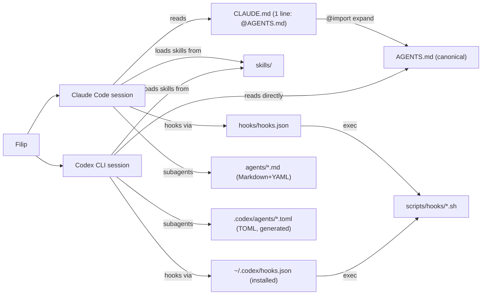

# claude-leverage

> **v1.0.0 (2026-05-24)** — pivot release. This started as a hypothesis that
> tier-routing across Sonnet/Haiku subagents would save tokens vs vanilla
> Claude Code. Three rounds of rigorous benchmarking on Opus 4.7 disproved
> that thesis (raw data in [`bench/archive-token-savings-thesis/`](bench/archive-token-savings-thesis/)).
> v1.0.0 pivots to a **personal Claude Code + Codex dev stack** focused on
> what the data still supports: deterministic security hooks, AI-first
> conventions, on-demand skills, and a portable statusline.
>
> The honest history lives in the archive — see [Honest history](#honest-history)
> at the bottom of this README.

[](https://github.com/Filip-Podstavec/claude-leverage/actions/workflows/ci.yml)
[](LICENSE)
[](https://docs.anthropic.com/en/docs/claude-code)
[](https://developers.openai.com/codex)
[]()

A small, opinionated dev stack — built for me first, public so I can install
it across machines. **Complements skills-based plugins like the official
`superpowers` plugin; it does not try to replace them.**

## What you get

- **Security hooks** (always-on, deterministic): `block-secrets-precommit`
  and `block-dangerous-git`. Run on every Bash tool call, cannot be
  bypassed by prompt injection.
- **`/security-review`** skill + read-only `security-reviewer` subagent
  (Sonnet) for OWASP-Top-10-shaped audits of the current diff, plus
  `package.json`/`requirements.txt` typosquatting heuristic. Self-contained
  — no dependency on any other plugin.
- **`/repo-map`** and **`/process-diagram`** skills — generate/update
  mermaid blocks in markdown between idempotent markers. `/repo-map`
  optionally appends a dep-graph block when `madge` or `pydeps` is installed.
- **`/stack-check`** skill + 30-day **`stack-freshness`** SessionStart hook
  — local-only timestamp nudge; explicit user-run check verifies tool
  versions, walks repos for stale AIDEV-TODO/QUESTION anchors, and sanity-
  checks AGENTS.md size against Codex's 32 KiB cap.
- **`/init-repo`** — bootstrap a new project: drop an AGENTS.md from the
  per-language template, add the right `.gitignore` patterns, optionally
  install a structured-logging template (Python / TypeScript / Go / Rust).
- **`/log-structured`** — find non-structured logging in a codebase and
  suggest spec-compliant replacements per the JSON-lines logging convention.
- **`/explain-diff`** — plain-English 3–5 bullet narration of the current
  diff. Useful before opening a PR or asking a teammate for review.
- **`/codex-sandbox`** — interactive helper to configure per-project
  `.codex/config.toml` sandbox + approval modes.
- **`/commit-smart`** — inline secret scan + Conventional Commits message
  + push. All in the main session, no subagent dispatch.
- **Portable statusline** — Python-based, no `jq` dep, Windows-friendly.
  Shows 5h/7d rate limits, context %, model, branch, session $ estimate.
- **AI-first code conventions** documented in `AGENTS.md`: AIDEV-NOTE
  anchors, JSON-lines logging spec, per-directory AGENTS.md template.
- **Dual-tool by design**: same `AGENTS.md` for Claude Code (via
  `@AGENTS.md` import in `CLAUDE.md`) and Codex (native read). Hook scripts
  shared via `scripts/hooks/`; skills installed to `~/.agents/skills/` by
  the Codex installer; agents authored in MD + auto-generated to TOML for
  Codex.

## Install — Claude Code

```
/plugin marketplace add Filip-Podstavec/claude-leverage
/plugin install claude-leverage@filip-podstavec
```

That's it for the plugin. For the statusline:
```bash
# Copy into ~/.claude/ — only overwrites if you have no statusline configured
cp statusline/statusline-command.sh ~/.claude/statusline-command.sh
chmod +x ~/.claude/statusline-command.sh
```

Then add to `~/.claude/settings.json`:
```json
"statusLine": { "type": "command", "command": "bash ~/.claude/statusline-command.sh" }
```

## Install — Codex CLI

Codex has no plugin marketplace, so installation is via a script:

```bash
# 1. Install Codex CLI itself (one time)
npm i -g @openai/codex

# 2. Clone this repo to a stable location
git clone https://github.com/Filip-Podstavec/claude-leverage.git ~/.local/share/claude-leverage
cd ~/.local/share/claude-leverage

# 3. Run the installer
bash scripts/install-codex.sh         # macOS / Linux / WSL2
# OR
pwsh scripts/install-codex.ps1        # Windows PowerShell
```

The installer:
1. Resolves repo path into `~/.codex/hooks.json` so security hooks fire in
   every Codex session globally.
2. Appends `@<repo-path>/AGENTS.md` to `~/.codex/AGENTS.md` so the canonical
   guidance loads on every Codex session.
3. Copies `.codex/agents/*.toml` to `~/.codex/agents/`.
4. Copies `skills/*` to `~/.agents/skills/claude-leverage/` so `/security-review`,
   `/repo-map`, `/process-diagram`, `/stack-check`, `/init-repo`,
   `/log-structured`, `/explain-diff`, and `/codex-sandbox` work in Codex.

Idempotent: re-running detects existing install via marker comments and
overwrites in place.

## What's inside

| Directory | Purpose |
|-----------|---------|
| [`agents/`](agents/) | Claude Code subagents (Markdown + YAML frontmatter) |
| [`.codex/agents/`](.codex/agents/) | Codex subagents (TOML; generated from `agents/`) |
| [`skills/`](skills/) | Cross-tool skills (`agentskills.io` SKILL.md spec) |
| [`commands/`](commands/) | Claude Code slash commands |
| [`hooks/hooks.json`](hooks/hooks.json) | Claude Code hook config (paths point at `scripts/hooks/`) |
| [`.codex/hooks.json`](.codex/hooks.json) | Codex hook config (template; installer resolves paths) |
| [`.codex/config.toml`](.codex/config.toml) | Codex sandbox/approval defaults |
| [`scripts/hooks/`](scripts/hooks/) | Hook shell scripts, shared by both tools |
| [`scripts/`](scripts/) | Installers (`install-codex.{sh,ps1}`), version checks, generators |
| [`statusline/`](statusline/) | Portable statusline script |
| [`claude-md-snippets/`](claude-md-snippets/) | Opt-in CLAUDE.md routing rules (none in default install) |
| [`templates/`](templates/) | Drop-in templates: per-language AGENTS.md examples, structured-logging starter kits, sample Codex config |
| [`bench/archive-token-savings-thesis/`](bench/archive-token-savings-thesis/) | Frozen evidence of the v0.x experiment that motivated the v1.0 pivot |
| [`docs/specs/`](docs/specs/) | Design specs (current and historical) |

## Architecture

<!-- repo-map:start -->
<!-- This block is regenerated by skills/repo-map. Do not hand-edit.    -->
<!-- Re-run /repo-map to refresh after directory structure changes.     -->

<!-- repo-map:end -->

## Workflow example

Typical session with the default install:

```
1. Edit code                       → Opus inline
2. Run tests inline                → Opus reads pytest output
3. /security-review                → security-reviewer subagent (Sonnet, read-only)
4. /commit-smart                   → inline secret scan + Conventional Commits + push
5. Hooks run silently throughout   → block-secrets-precommit, block-dangerous-git
```

After ≥50 LOC of net-new code without an `AIDEV-NOTE:` anchor, the
`ai-first-nudge` PostToolUse hook prints a one-liner suggestion. After
≥80 LOC of net-new code in security-sensitive paths (auth, crypto, routes,
templates), the `security-nudge` Stop hook suggests `/security-review`. Both
are non-blocking.

When you haven't run `/stack-check` in 30+ days, the `stack-freshness`
SessionStart hook prints a one-liner reminder — local timestamp only, no
network. The actual version check (Claude Code, Codex, plugin, CLI deps)
only fires when you explicitly run `/stack-check`.

## Why this is a single repo for two tools

Per the [research](docs/specs/research/research_dual_codex_claude.md):
`AGENTS.md` is the open spec both tools converge on. Claude Code reads
`CLAUDE.md` natively but its `@<path>` import lets `CLAUDE.md` be a one-line
redirect to `AGENTS.md`. Hook event vocabularies match between the two tools
(`PreToolUse`, `PostToolUse`, `SessionStart`, `Stop`), so the same shell
scripts work for both — only the trigger config differs. Subagents must be
authored twice (MD+YAML for Claude, TOML for Codex), but `scripts/gen-codex-agents.py`
keeps them in sync.

## Update / uninstall

**Claude Code:**
```
/plugin marketplace update
/plugin update claude-leverage
/plugin uninstall claude-leverage@filip-podstavec
```

**Codex (uninstall):**

```bash
# Linux / macOS / WSL2
rm -rf ~/.agents/skills/claude-leverage
rm    ~/.codex/agents/security-reviewer.toml ~/.codex/agents/flaky-test-isolator.toml
# restore original ~/.codex/hooks.json (the installer leaves a .bak)
mv ~/.codex/hooks.json.pre-claude-leverage.bak ~/.codex/hooks.json 2>/dev/null \
   || rm ~/.codex/hooks.json
# Edit ~/.codex/AGENTS.md and delete the block between the two
# "# claude-leverage:" markers.
```

PowerShell variant:
```powershell
Remove-Item -Recurse -Force $env:USERPROFILE\.agents\skills\claude-leverage
Remove-Item -Force $env:USERPROFILE\.codex\agents\security-reviewer.toml,$env:USERPROFILE\.codex\agents\flaky-test-isolator.toml
$bak = "$env:USERPROFILE\.codex\hooks.json.pre-claude-leverage.bak"
if (Test-Path $bak) { Move-Item -Force $bak "$env:USERPROFILE\.codex\hooks.json" }
else { Remove-Item -Force "$env:USERPROFILE\.codex\hooks.json" }
# Then edit ~/.codex/AGENTS.md and remove the marker block.
```

## Honest history

The benchmark series that disproved the v0.x token-savings thesis is in
[`bench/archive-token-savings-thesis/`](bench/archive-token-savings-thesis/) —
charts, raw stream-json transcripts, audit harnesses, the 11 retired
subagents, and the original `extras-README.md` documenting per-agent
verdicts.

Headline finding (Opus 4.7, 2026-05-24):

| Stage | Baseline | Leveraged | Delta |
|---|---:|---:|---:|
| Cold cache, 4 tasks                 | $0.37 | $0.64 | **+73 %** |
| Warm cache, 4-turn workflow         | $0.24 | $0.39 | **+63 %** |
| Warm cache, 12-turn day-in-the-life | $0.51 | $1.11 | **+117 %** |

The plugin model's per-invocation dispatch overhead structurally exceeded
the per-token savings from delegating execution to Sonnet/Haiku. Prompt
caching on Opus 4.7 makes "read large, emit small" cheap inline. v1.0.0 is
what's left after subtracting everything the data killed.

Full design docs for the pivot: [`docs/specs/2026-05-24-pivot/`](docs/specs/2026-05-24-pivot/).

## License

[MIT](LICENSE) — see also [CONTRIBUTING.md](CONTRIBUTING.md).
