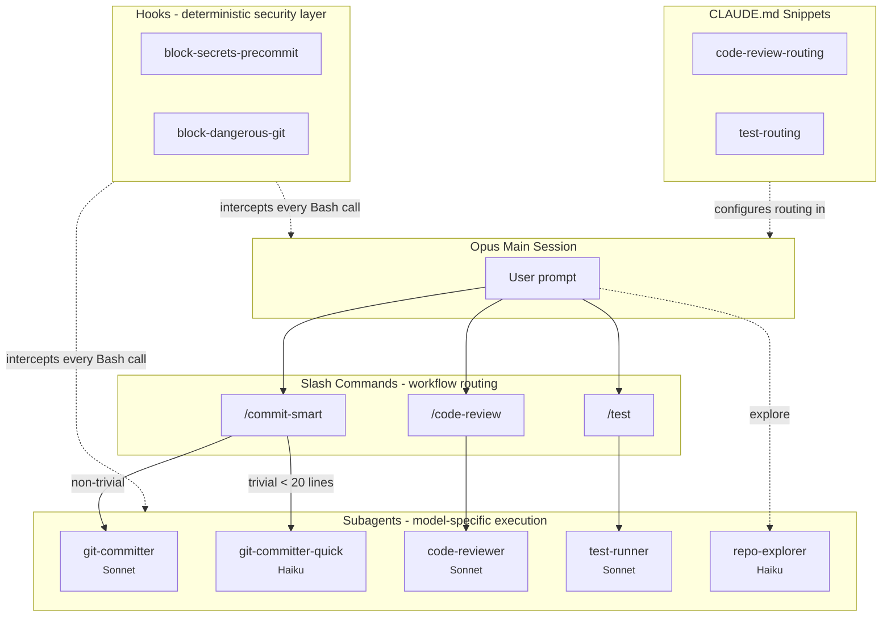

# claude-leverage

**Curated subagents, slash commands, hooks, and workflow patterns for Claude Code.**

[](LICENSE)
[](https://github.com/Filip-Podstavec/claude-leverage/stargazers)
[](https://github.com/Filip-Podstavec/claude-leverage/issues)
[](https://docs.anthropic.com/en/docs/claude-code)
[]()


**Quick install:**
```
/plugin marketplace add Filip-Podstavec/claude-leverage
/plugin install claude-leverage@filip-podstavec
```

## Why

Claude Code is an orchestration layer, not a single model call. The most capable model does not need to handle every task - a code review can run on Sonnet while Opus plans architecture, a trivial commit can use Haiku while Sonnet handles complex changes. This repo provides building blocks for routing work across model tiers to **reduce token costs** and **preserve output quality** at the same time.

Security guardrails belong in hooks (deterministic, always-on), not in subagent prompts (active only when that prompt runs). Workflow guidance belongs in slash commands and subagent prompts. This separation is intentional.

## Architecture



## What's inside

| Directory | Purpose | Contents |
|-----------|---------|----------|
| [`hooks/`](hooks/) | Deterministic security guardrails | Shell scripts that run on every tool call - block secrets, prevent force push |
| [`agents/`](agents/) | Model-specific execution | Subagents with isolated context: Sonnet for review/commits, Haiku for trivial plumbing |
| [`commands/`](commands/) | Workflow orchestration | Slash commands that route work based on complexity and scope |
| [`claude-md-snippets/`](claude-md-snippets/) | Drop-in CLAUDE.md rules | Routing rules that go into your project's CLAUDE.md |
| [`skills/`](skills/) | Reusable skills | Specialized capability modules for Claude Code |
| [`workflows/`](workflows/) | Patterns and guides | End-to-end guides on combining components |

## Components

### Agents

| Agent | Model | Description |
|-------|-------|-------------|
| [`git-committer`](agents/git-committer.md) | Sonnet | Stage, commit, push for non-trivial changes. Reads diff, writes Conventional Commits message. Never modifies code. |
| [`git-committer-quick`](agents/git-committer-quick.md) | Haiku | Speed-optimized variant for trivial commits only (single file, <20 lines). Separate rate pool. |
| [`code-reviewer`](agents/code-reviewer.md) | Sonnet | Read-only code reviewer. Returns structured findings (Critical / Important / Nice to have). Never modifies files. |
| [`test-runner`](agents/test-runner.md) | Sonnet | Detects test framework, runs tests, returns structured failure analysis. Read-only. |
| [`repo-explorer`](agents/repo-explorer.md) | Haiku | Read-only codebase exploration. Finds where things are defined, identifies patterns, returns structured findings. Never modifies code. |

### Commands

| Command | Description |
|---------|-------------|
| [`/commit-smart`](commands/commit-smart.md) | Routes commits by complexity: trivial changes handled directly, non-trivial delegated to `git-committer` subagent. |
| [`/code-review`](commands/code-review.md) | Delegates review to `code-reviewer` subagent, orchestrates user-confirmed fixes in main session. |
| [`/test`](commands/test.md) | Delegates test execution to `test-runner` subagent, orchestrates user-confirmed fixes in main session. |

### Hooks

| Hook | Trigger | Description |
|------|---------|-------------|
| [`block-secrets-precommit`](hooks/block-secrets-precommit.sh) | `git commit` | Scans staged diff for API keys, tokens, private keys. Blocks commit if found. |
| [`block-dangerous-git`](hooks/block-dangerous-git.sh) | `git push`, `git commit`, `git reset` | Blocks force push, `--no-verify`, hard reset on protected branches. |

### CLAUDE.md Snippets

| Snippet | Pairs with |
|---------|------------|
| [`code-review-routing`](claude-md-snippets/code-review-routing.md) | `code-reviewer` agent + `/code-review` command |
| [`test-routing`](claude-md-snippets/test-routing.md) | `test-runner` agent + `/test` command |

## Workflow example

A typical development cycle using claude-leverage:

```
1. Explore codebase if needed          → Haiku repo-explorer (Opus saves context)
2. Write code                          → Opus main session
3. /code-review                        → Sonnet reviews (Opus saves context)
4. Apply fixes from review             → Opus applies, guided by Sonnet's report
5. /test                               → Sonnet runs tests, reports failures
6. Fix failing tests                   → Opus fixes, guided by Sonnet's report
7. /commit-smart                       → Routes automatically:
   ├─ trivial (1-2 files, <50 lines)   → commits directly in session
   ├─ trivial + single file <20 lines  → optionally Haiku subagent
   └─ non-trivial                      → Sonnet git-committer subagent
8. Hooks run silently on every step    → block secrets, prevent force push
```

**Result:** Opus handles only architecture and code changes. Reviews, tests, and commits run on cheaper models. Hooks enforce security without relying on any prompt.

## Quick install (recommended)

The fastest way to get the full claude-leverage stack is to install it as a Claude Code plugin. This installs all agents, commands, and hooks at user scope by default - they work across every project on your machine.

In a running Claude Code session:

```
/plugin marketplace add Filip-Podstavec/claude-leverage
/plugin install claude-leverage@filip-podstavec
```

That's it. All five agents, three commands, and two hooks are now available globally. Verify with `/agents` and `/commands`.

**Update and uninstall:**

```
/plugin marketplace update          # refresh catalog
/plugin update claude-leverage      # update to latest version
/plugin uninstall claude-leverage@filip-podstavec
```

**Scope notes:** By default, plugins install to user scope (`~/.claude/plugins/`) and apply across all your projects. If you install with project scope (via the interactive `/plugin` UI), be aware of a known limitation: project-scoped plugins cannot be promoted to user scope through the UI - you would need to uninstall and reinstall. For most users, the default user scope is the right choice.

**CLAUDE.md snippets and workflow guides** are documentation, not Claude Code primitives - the plugin does not install them. Copy what you need from [`claude-md-snippets/`](claude-md-snippets/) into your project's CLAUDE.md file.

## Manual install (advanced)

Prefer to cherry-pick individual components or modify them before installing? You can copy files directly into `~/.claude/` or your project's `.claude/` directory. This bypasses the plugin system - useful when you want to fork specific agents, run a custom version, or install only a subset.

```bash
git clone https://github.com/Filip-Podstavec/claude-leverage.git
cd claude-leverage
```

Open the repo in Claude Code and tell it to set you up. The agent will walk you through three groups of components, explain what each does, and let you pick what to install and where.

### 1. Security hooks (recommended for everyone)

> **Impact:** Zero change to your workflow. Hooks run silently in the background on every tool call and block dangerous operations before they happen.

| What gets installed | What it does |
|---------------------|--------------|
| `block-secrets-precommit.sh` | Scans staged diff for API keys, tokens, private keys - blocks the commit if found |
| `block-dangerous-git.sh` | Blocks force push, `--no-verify`, hard reset on protected branches |

**Scope:** User-level only (`~/.claude/hooks/`) - hooks protect all your projects, not just one.

```bash
mkdir -p ~/.claude/hooks
cp hooks/*.sh ~/.claude/hooks/
chmod +x ~/.claude/hooks/*.sh
```

Then register in `~/.claude/settings.json` - see [`hooks/README.md`](hooks/README.md) for the JSON config.

### 2. Cost optimization (no quality impact)

> **Impact:** Commits that don't require deep reasoning get routed to cheaper models (Sonnet/Haiku) instead of consuming Opus context. Your code quality stays the same - only the commit workflow gets delegated.

| What gets installed | What it does |
|---------------------|--------------|
| `git-committer` agent | Handles non-trivial commits on Sonnet - reads diff, writes Conventional Commits message |
| `git-committer-quick` agent | Handles trivial commits on Haiku - single file, <20 lines, separate rate pool |
| `/commit-smart` command | Routing logic: measures diff size and routes to the right tier automatically |

**Scope:** Choose one:
- **User-level** (`~/.claude/agents/`, `~/.claude/commands/`) - available in all your projects
- **Project-level** (`.claude/agents/`, `.claude/commands/`) - committed to your repo, shared with the team

```bash
# User scope
mkdir -p ~/.claude/agents ~/.claude/commands
cp agents/git-committer.md agents/git-committer-quick.md ~/.claude/agents/
cp commands/commit-smart.md ~/.claude/commands/

# - OR - Project scope
mkdir -p .claude/agents .claude/commands
cp agents/git-committer.md agents/git-committer-quick.md .claude/agents/
cp commands/commit-smart.md .claude/commands/
```

### 3. Quality workflows (adds new capabilities)

> **Impact:** Adds code review and test delegation workflows. Sonnet handles the review/test execution, Opus only sees the structured report and applies fixes. Saves Opus context while adding structured quality gates.

| What gets installed | What it does |
|---------------------|--------------|
| `code-reviewer` agent + `/code-review` command | Sonnet reviews code, returns Critical/Important/Nice-to-have findings |
| `test-runner` agent + `/test` command | Sonnet runs tests, returns structured failure analysis |
| `repo-explorer` agent | Haiku-based codebase discovery, finds where things are defined |
| CLAUDE.md snippets | Auto-routing rules so the main session delegates without you typing the command |

**Scope:** Same choice as above - user-level or project-level. Snippets go into your `CLAUDE.md`.

```bash
# User scope
cp agents/code-reviewer.md agents/test-runner.md agents/repo-explorer.md ~/.claude/agents/
cp commands/code-review.md commands/test.md ~/.claude/commands/

# - OR - Project scope
cp agents/code-reviewer.md agents/test-runner.md agents/repo-explorer.md .claude/agents/
cp commands/code-review.md commands/test.md .claude/commands/
```

Then copy the snippets you want from [`claude-md-snippets/`](claude-md-snippets/) into your `CLAUDE.md`.

### After install

Run `/agents` or `/commands` in a running Claude Code session to pick up changes without restarting.

## Philosophy

### Three layers of defense

| Layer | Mechanism | Scope | Example |
|-------|-----------|-------|---------|
| **Hooks** | Deterministic shell scripts | Every tool call, every session | Block secrets in staged diff |
| **Commands** | Workflow routing with bash preambles | When user invokes the command | Route trivial vs non-trivial commits |
| **Subagent prompts** | LLM-level guidance | When that subagent is active | "Never modify code, only report" |

Hooks are the primary safety layer because they cannot be bypassed by prompt injection or model hallucination. Commands encode workflow logic. Subagent prompts are the last resort.

### Model tiering

| Tier | Model | Use case | Cost |
|------|-------|----------|------|
| **Orchestration** | Opus | Architecture decisions, complex code changes, planning | Highest |
| **Execution** | Sonnet | Code review, non-trivial commits, test analysis | Medium |
| **Plumbing** | Haiku | Trivial commits, codebase exploration, mechanical tasks | Lowest |

Each subagent declares its model explicitly in frontmatter. No implicit inheritance.

## License

[MIT](LICENSE)

## Contributing

See [CONTRIBUTING.md](CONTRIBUTING.md).
