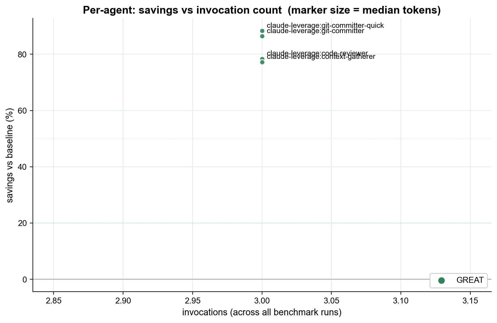

# Per-agent verdicts - claude-leverage v0.10.0  (2026-05-21_v0.10.0)

**Internal report - not part of README.** Use to decide which agents to improve, delete, or add.

## Verdicts

| Verdict | Agent | Invocations | Tier(s) | Median tokens | Baseline est. | Savings | Quality |
|---|---|---:|---|---:|---:|---:|---:|
| GREAT | `claude-leverage:git-committer-quick` | 3 | haiku | 5.8k (5.8k-5.9k) | 49.6k | -88% | 100% |
| GREAT | `claude-leverage:git-committer` | 3 | sonnet | 6.9k (6.9k-7.0k) | 51.1k | -86% | 100% |
| GREAT | `claude-leverage:code-reviewer` | 3 | sonnet | 7.4k (7.2k-7.5k) | 34.0k | -78% | 100% |
| GREAT | `claude-leverage:context-gatherer` | 3 | sonnet | 8.1k (8.0k-9.3k) | 35.5k | -77% | 100% |

## Reading this report

**Important: this measures agent-execution efficiency, NOT system-level cost.**

An agent can show -78% savings here while the leveraged session as a whole costs MORE than baseline. Example: `code-reviewer` (Sonnet) uses 7k tokens to do the review; baseline Opus does the same review in 34k tokens. The agent itself is efficient. But the leveraged session also pays for Opus orchestration (~30k tokens to dispatch, read the report, and integrate). Net session cost can still be higher than baseline.

Use this report to ask: **is each agent doing its piece efficiently?** Use `report.md` (hero chart) to ask: **does the plugin net out cheaper overall?**

- **Baseline estimate** is the median total tokens the *baseline session* spent on the same task (the counterfactual: 'what would Opus alone have done if it did the whole task').
- **Savings** is `(baseline_estimate - median_agent_tokens) / baseline_estimate`. This is agent intrinsic efficiency, not net session savings. Negative = agent uses more tokens than baseline did total on the same task.
- **Quality** is the pass rate of the deterministic task-level check across all leveraged runs that engaged this agent. A low rate means the savings number is suspect.
- **Insufficient data** = n_invocations < 3. The mini-suite invokes each agent at most N times (one task per agent), so most rows will be INSUFFICIENT in v1. The realistic suite (v2) will fix this by spreading invocations across more tasks.

## Actions to consider

**Clear wins** (keep, possibly use as templates for future agents):
- `claude-leverage:git-committer-quick` - savings 88%, quality 100%
- `claude-leverage:git-committer` - savings 86%, quality 100%
- `claude-leverage:code-reviewer` - savings 78%, quality 100%
- `claude-leverage:context-gatherer` - savings 77%, quality 100%
