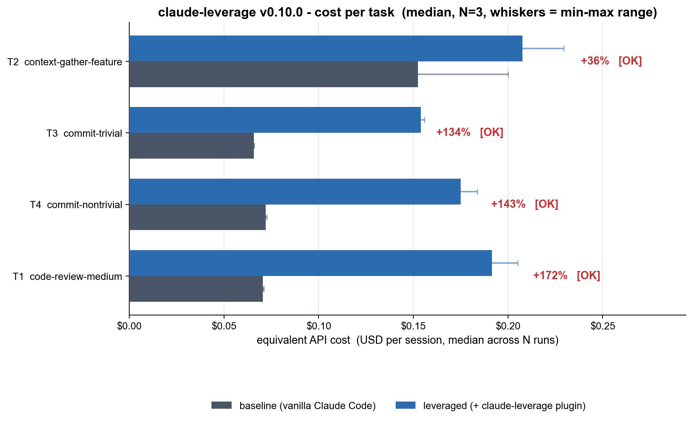
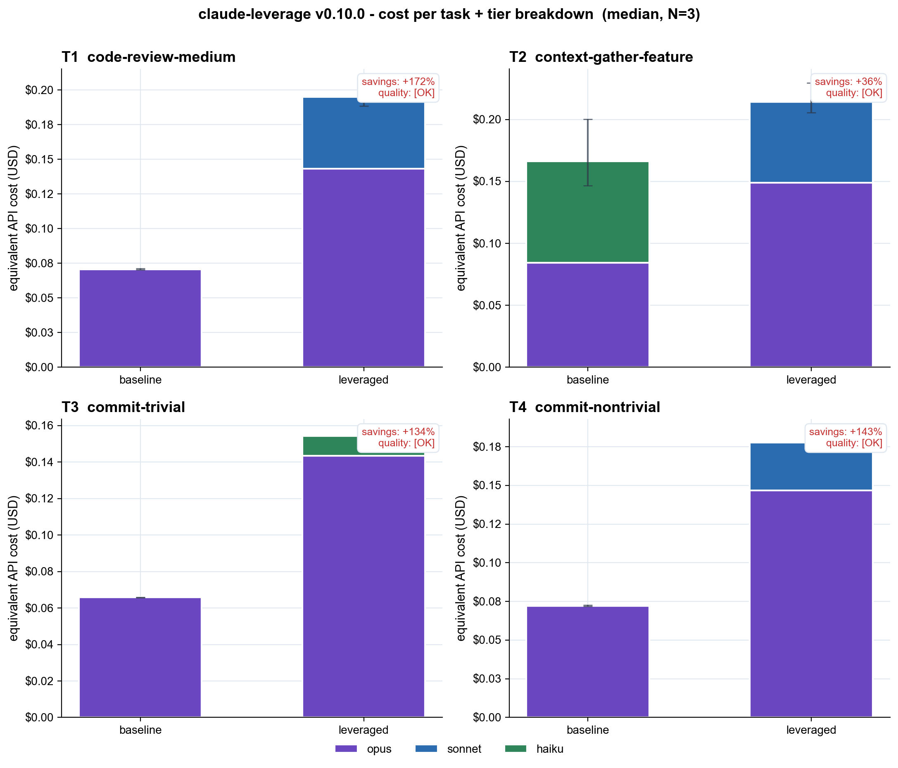

# claude-leverage benchmark - 2026-05-21_v0.10.0

- Plugin version: **v0.10.0**
- Claude Code version: **2.1.89 (Claude Code)**
- Started: 2026-05-21T12:44:58Z
- Finished: 2026-05-21T13:03:55Z
- N runs per (task x condition): **3**
- Total cost (subscription tokens consumed): **$3.348**

## Headline

Median **cost** summed across 4 tasks: baseline **$0.361** -> leveraged **$0.728**  (**+102%**).

Median **tokens** summed: baseline **170.2k** -> leveraged **184.6k**  (+8%).

## Per-task breakdown

| Task | Baseline cost | Leveraged cost | Cost savings | Tokens (b -> l) | Quality |
|---|---:|---:|---:|---:|---:|
| T2 context-gather-feature | $0.152 ($0.147-$0.200) | $0.208 ($0.205-$0.229) | +36% | 35.5k -> 37.4k | [OK] |
| T3 commit-trivial | $0.066 ($0.066-$0.066) | $0.154 ($0.153-$0.156) | +134% | 49.6k -> 54.8k | [OK] |
| T4 commit-nontrivial | $0.072 ($0.072-$0.073) | $0.175 ($0.174-$0.184) | +143% | 51.1k -> 55.4k | [OK] |
| T1 code-review-medium | $0.070 ($0.070-$0.071) | $0.192 ($0.188-$0.205) | +172% | 34.0k -> 37.0k | [OK] |

## Run-by-run detail

| Cell | Tokens | Cost USD | Duration | Quality | Notes |
|---|---:|---:|---:|---:|---|
| T1__baseline__r0 | 34.1k | $0.071 | 23.4s | [OK] |  |
| T1__baseline__r1 | 34.0k | $0.070 | 21.6s | [OK] |  |
| T1__baseline__r2 | 34.0k | $0.070 | 20.1s | [OK] |  |
| T1__leveraged__r0 | 37.3k | $0.205 | 60.4s | [OK] |  |
| T1__leveraged__r1 | 36.8k | $0.188 | 80.9s | [OK] |  |
| T1__leveraged__r2 | 37.0k | $0.192 | 67.4s | [OK] |  |
| T2__baseline__r0 | 35.5k | $0.200 | 99.2s | [OK] |  |
| T2__baseline__r1 | 35.5k | $0.147 | 86.0s | [OK] |  |
| T2__baseline__r2 | 35.9k | $0.152 | 103.6s | [OK] |  |
| T2__leveraged__r0 | 37.4k | $0.229 | 123.6s | [OK] |  |
| T2__leveraged__r1 | 37.3k | $0.205 | 61.8s | [OK] |  |
| T2__leveraged__r2 | 37.4k | $0.208 | 64.5s | [OK] |  |
| T3__baseline__r0 | 49.6k | $0.066 | 11.4s | [OK] |  |
| T3__baseline__r1 | 49.6k | $0.066 | 12.6s | [OK] |  |
| T3__baseline__r2 | 49.6k | $0.066 | 11.9s | [OK] |  |
| T3__leveraged__r0 | 54.8k | $0.154 | 32.7s | [OK] |  |
| T3__leveraged__r1 | 54.9k | $0.156 | 29.2s | [OK] |  |
| T3__leveraged__r2 | 54.8k | $0.153 | 31.9s | [OK] |  |
| T4__baseline__r0 | 51.1k | $0.072 | 18.5s | [OK] |  |
| T4__baseline__r1 | 51.2k | $0.073 | 13.7s | [OK] |  |
| T4__baseline__r2 | 51.1k | $0.072 | 13.2s | [OK] |  |
| T4__leveraged__r0 | 55.3k | $0.184 | 36.6s | [OK] |  |
| T4__leveraged__r1 | 55.5k | $0.174 | 41.7s | [OK] |  |
| T4__leveraged__r2 | 55.4k | $0.175 | 34.3s | [OK] |  |

## What this does and does NOT measure

- **Measured:** real token usage and equivalent API cost (USD) from `claude -p` stream-json `result` events, in headless sessions with isolated profiles.
- **Not measured:** wall-clock end-user latency, statistical significance (N=3 is too small), realistic-suite coverage, multi-language fixtures.
- **Baseline = vanilla Claude Code** (with its built-in `Explore`, `general-purpose`, `Plan`, `statusline-setup` agents). Not 'Opus alone with no agents'.
- **Cold cache:** every session uses a fresh CLAUDE_CONFIG_DIR, so every session pays cache-creation cost. Warm-cache numbers would be lower for both conditions but not necessarily symmetrically.
- **Quality gate:** each leveraged run is checked against a deterministic regex / git assertion. A run with `FAIL` is *included* in the table but flagged; if every leveraged run fails on a task, treat the savings number with extreme skepticism.

Raw stream-json per cell: see `raw/`.