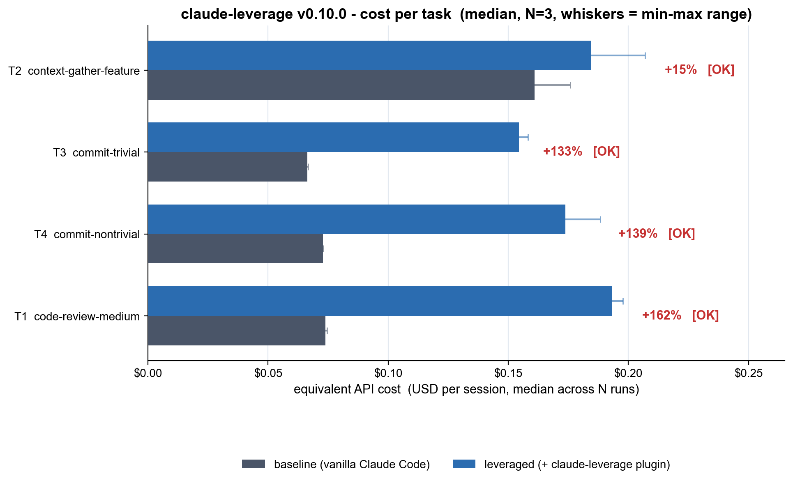

# claude-leverage benchmark - 2026-05-23_v0.10.0-cold-post-trim

- Plugin version: **v0.10.0**
- Claude Code version: **2.1.89 (Claude Code)**
- Started: 2026-05-23T18:43:45Z
- Finished: 2026-05-23T19:00:12Z
- N runs per (task x condition): **3**
- Total cost (subscription tokens consumed): **$3.242**

## Headline

Median **cost** summed across 4 tasks: baseline **$0.374** -> leveraged **$0.706**  (**+89%**).

Median **tokens** summed: baseline **170.8k** -> leveraged **185.4k**  (+9%).

## Per-task breakdown

| Task | Baseline cost | Leveraged cost | Cost savings | Tokens (b -> l) | Quality |
|---|---:|---:|---:|---:|---:|
| T2 context-gather-feature | $0.161 ($0.158-$0.176) | $0.184 ($0.177-$0.207) | +15% | 35.8k -> 37.6k | [OK] |
| T3 commit-trivial | $0.066 ($0.066-$0.067) | $0.154 ($0.153-$0.158) | +133% | 49.6k -> 55.0k | [OK] |
| T4 commit-nontrivial | $0.073 ($0.073-$0.073) | $0.174 ($0.173-$0.188) | +139% | 51.2k -> 55.6k | [OK] |
| T1 code-review-medium | $0.074 ($0.072-$0.075) | $0.193 ($0.149-$0.198) | +162% | 34.2k -> 37.1k | [OK] |

## Run-by-run detail

| Cell | Tokens | Cost USD | Duration | Quality | Notes |
|---|---:|---:|---:|---:|---|
| T1__baseline__r0 | 34.1k | $0.072 | 22.4s | [OK] |  |
| T1__baseline__r1 | 34.2k | $0.074 | 30.9s | [OK] |  |
| T1__baseline__r2 | 34.2k | $0.075 | 25.8s | [OK] |  |
| T1__leveraged__r0 | 36.9k | $0.149 | 30.1s | [OK] |  |
| T1__leveraged__r1 | 37.1k | $0.193 | 61.6s | [OK] |  |
| T1__leveraged__r2 | 37.3k | $0.198 | 61.2s | [OK] |  |
| T2__baseline__r0 | 35.8k | $0.176 | 87.0s | [OK] |  |
| T2__baseline__r1 | 35.6k | $0.161 | 83.6s | [OK] |  |
| T2__baseline__r2 | 36.5k | $0.158 | 81.7s | [OK] |  |
| T2__leveraged__r0 | 56.5k | $0.207 | 60.9s | [OK] |  |
| T2__leveraged__r1 | 37.1k | $0.177 | 46.9s | [OK] |  |
| T2__leveraged__r2 | 37.6k | $0.184 | 59.0s | [OK] |  |
| T3__baseline__r0 | 49.6k | $0.066 | 11.7s | [OK] |  |
| T3__baseline__r1 | 49.6k | $0.066 | 15.9s | [OK] |  |
| T3__baseline__r2 | 49.7k | $0.067 | 13.5s | [OK] |  |
| T3__leveraged__r0 | 55.3k | $0.158 | 30.6s | [OK] |  |
| T3__leveraged__r1 | 54.8k | $0.153 | 32.0s | [OK] |  |
| T3__leveraged__r2 | 55.0k | $0.154 | 27.7s | [OK] |  |
| T4__baseline__r0 | 51.2k | $0.073 | 13.7s | [OK] |  |
| T4__baseline__r1 | 51.2k | $0.073 | 17.0s | [OK] |  |
| T4__baseline__r2 | 51.2k | $0.073 | 14.9s | [OK] |  |
| T4__leveraged__r0 | 55.4k | $0.188 | 46.3s | [OK] |  |
| T4__leveraged__r1 | 55.6k | $0.173 | 35.8s | [OK] |  |
| T4__leveraged__r2 | 55.6k | $0.174 | 36.4s | [OK] |  |

## What this does and does NOT measure

- **Measured:** real token usage and equivalent API cost (USD) from `claude -p` stream-json `result` events, in headless sessions with isolated profiles.
- **Not measured:** wall-clock end-user latency, statistical significance (N=3 is too small), realistic-suite coverage, multi-language fixtures.
- **Baseline = vanilla Claude Code** (with its built-in `Explore`, `general-purpose`, `Plan`, `statusline-setup` agents). Not 'Opus alone with no agents'.
- **Cold cache:** every session uses a fresh CLAUDE_CONFIG_DIR, so every session pays cache-creation cost. Warm-cache numbers would be lower for both conditions but not necessarily symmetrically.
- **Quality gate:** each leveraged run is checked against a deterministic regex / git assertion. A run with `FAIL` is *included* in the table but flagged; if every leveraged run fails on a task, treat the savings number with extreme skepticism.

Raw stream-json per cell: see `raw/`.