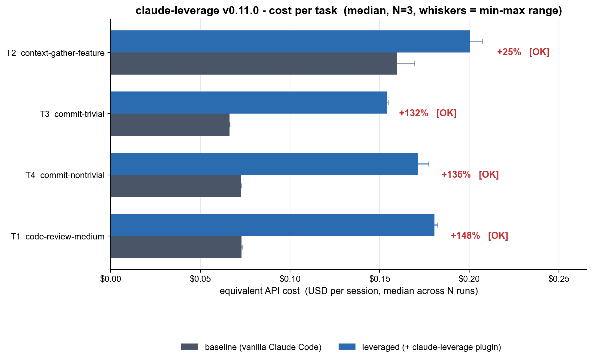
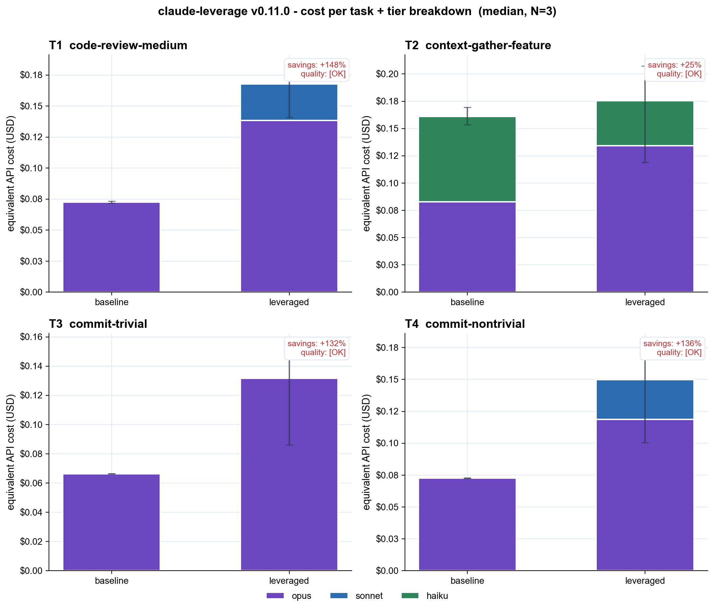

# claude-leverage benchmark - 2026-05-23_v0.11.0-cold-reverted

- Plugin version: **v0.11.0**
- Claude Code version: **2.1.89 (Claude Code)**
- Started: 2026-05-23T20:12:21Z
- Finished: 2026-05-23T20:28:45Z
- N runs per (task x condition): **3**
- Total cost (subscription tokens consumed): **$2.993**

## Headline

Median **cost** summed across 4 tasks: baseline **$0.372** -> leveraged **$0.707**  (**+90%**).

Median **tokens** summed: baseline **170.4k** -> leveraged **215.8k**  (+27%).

## Per-task breakdown

| Task | Baseline cost | Leveraged cost | Cost savings | Tokens (b -> l) | Quality |
|---|---:|---:|---:|---:|---:|
| T2 context-gather-feature | $0.160 ($0.154-$0.169) | $0.200 ($0.119-$0.207) | +25% | 35.4k -> 55.1k | [OK] |
| T3 commit-trivial | $0.066 ($0.066-$0.066) | $0.154 ($0.086-$0.155) | +132% | 49.6k -> 71.5k | [OK] |
| T4 commit-nontrivial | $0.073 ($0.072-$0.073) | $0.172 ($0.101-$0.177) | +136% | 51.2k -> 53.5k | [OK] |
| T1 code-review-medium | $0.073 ($0.072-$0.073) | $0.181 ($0.141-$0.182) | +148% | 34.2k -> 35.7k | [OK] |

## Run-by-run detail

| Cell | Tokens | Cost USD | Duration | Quality | Notes |
|---|---:|---:|---:|---:|---|
| T1__baseline__r0 | 34.1k | $0.072 | 22.5s | [OK] |  |
| T1__baseline__r1 | 34.2k | $0.073 | 31.8s | [OK] |  |
| T1__baseline__r2 | 34.2k | $0.073 | 25.5s | [OK] |  |
| T1__leveraged__r0 | 35.7k | $0.182 | 48.8s | [OK] |  |
| T1__leveraged__r1 | 35.7k | $0.141 | 21.9s | [OK] |  |
| T1__leveraged__r2 | 35.7k | $0.181 | 66.5s | [OK] |  |
| T2__baseline__r0 | 35.4k | $0.160 | 74.3s | [OK] |  |
| T2__baseline__r1 | 35.3k | $0.169 | 83.6s | [OK] |  |
| T2__baseline__r2 | 36.0k | $0.154 | 78.0s | [OK] |  |
| T2__leveraged__r0 | 36.0k | $0.119 | 69.1s | [OK] |  |
| T2__leveraged__r1 | 55.3k | $0.200 | 75.2s | [OK] |  |
| T2__leveraged__r2 | 55.1k | $0.207 | 65.8s | [OK] |  |
| T3__baseline__r0 | 49.6k | $0.066 | 10.6s | [OK] |  |
| T3__baseline__r1 | 49.6k | $0.066 | 12.5s | [OK] |  |
| T3__baseline__r2 | 49.6k | $0.066 | 13.8s | [OK] |  |
| T3__leveraged__r0 | 71.3k | $0.086 | 22.4s | [OK] |  |
| T3__leveraged__r1 | 71.8k | $0.155 | 26.1s | [OK] |  |
| T3__leveraged__r2 | 71.5k | $0.154 | 28.8s | [OK] |  |
| T4__baseline__r0 | 51.2k | $0.073 | 20.5s | [OK] |  |
| T4__baseline__r1 | 51.2k | $0.073 | 16.0s | [OK] |  |
| T4__baseline__r2 | 51.2k | $0.072 | 13.9s | [OK] |  |
| T4__leveraged__r0 | 53.0k | $0.177 | 31.3s | [OK] |  |
| T4__leveraged__r1 | 53.8k | $0.172 | 41.4s | [OK] |  |
| T4__leveraged__r2 | 53.5k | $0.101 | 46.2s | [OK] |  |

## What this does and does NOT measure

- **Measured:** real token usage and equivalent API cost (USD) from `claude -p` stream-json `result` events, in headless sessions with isolated profiles.
- **Not measured:** wall-clock end-user latency, statistical significance (N=3 is too small), realistic-suite coverage, multi-language fixtures.
- **Baseline = vanilla Claude Code** (with its built-in `Explore`, `general-purpose`, `Plan`, `statusline-setup` agents). Not 'Opus alone with no agents'.
- **Cold cache:** every session uses a fresh CLAUDE_CONFIG_DIR, so every session pays cache-creation cost. Warm-cache numbers would be lower for both conditions but not necessarily symmetrically.
- **Quality gate:** each leveraged run is checked against a deterministic regex / git assertion. A run with `FAIL` is *included* in the table but flagged; if every leveraged run fails on a task, treat the savings number with extreme skepticism.

Raw stream-json per cell: see `raw/`.