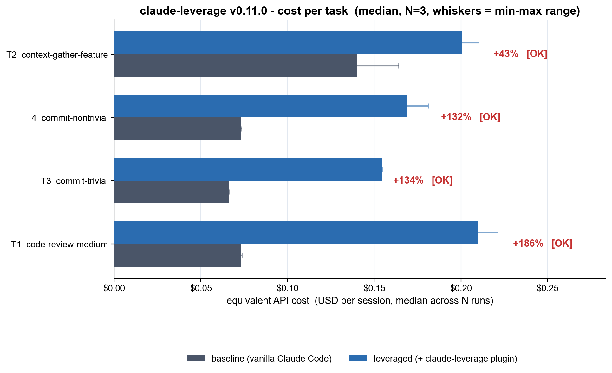
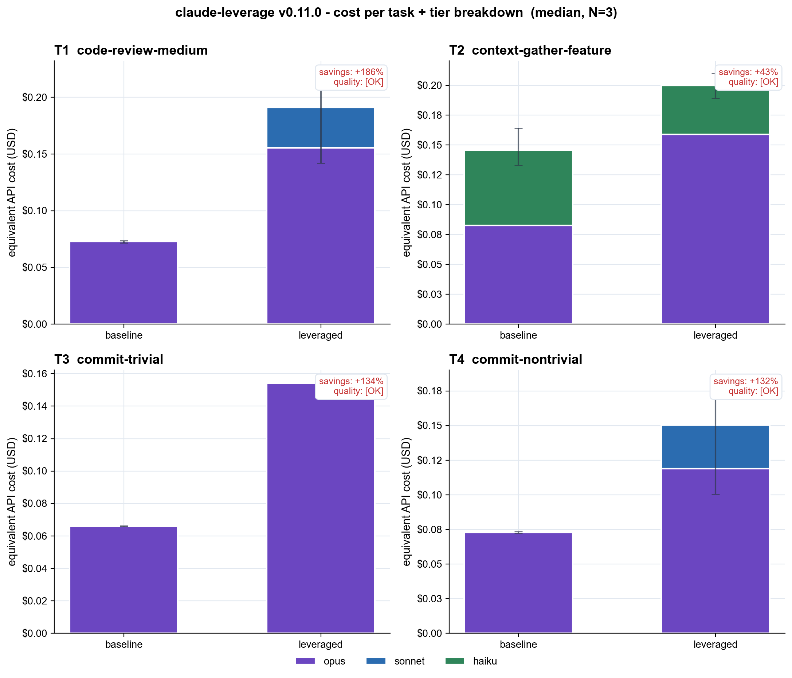

# claude-leverage benchmark - 2026-05-23_v0.11.0-cold

- Plugin version: **v0.11.0**
- Claude Code version: **2.1.89 (Claude Code)**
- Started: 2026-05-23T19:39:40Z
- Finished: 2026-05-23T19:56:28Z
- N runs per (task x condition): **3**
- Total cost (subscription tokens consumed): **$3.161**

## Headline

Median **cost** summed across 4 tasks: baseline **$0.353** -> leveraged **$0.734**  (**+108%**).

Median **tokens** summed: baseline **170.4k** -> leveraged **235.1k**  (+38%).

## Per-task breakdown

| Task | Baseline cost | Leveraged cost | Cost savings | Tokens (b -> l) | Quality |
|---|---:|---:|---:|---:|---:|
| T2 context-gather-feature | $0.140 ($0.133-$0.164) | $0.200 ($0.189-$0.210) | +43% | 35.5k -> 54.8k | [OK] |
| T4 commit-nontrivial | $0.073 ($0.072-$0.073) | $0.169 ($0.101-$0.181) | +132% | 51.2k -> 53.5k | [OK] |
| T3 commit-trivial | $0.066 ($0.066-$0.066) | $0.155 ($0.154-$0.155) | +134% | 49.6k -> 71.3k | [OK] |
| T1 code-review-medium | $0.073 ($0.072-$0.074) | $0.210 ($0.142-$0.221) | +186% | 34.2k -> 55.4k | [OK] |

## Run-by-run detail

| Cell | Tokens | Cost USD | Duration | Quality | Notes |
|---|---:|---:|---:|---:|---|
| T1__baseline__r0 | 34.1k | $0.072 | 23.5s | [OK] |  |
| T1__baseline__r1 | 34.2k | $0.073 | 32.4s | [OK] |  |
| T1__baseline__r2 | 34.2k | $0.074 | 25.6s | [OK] |  |
| T1__leveraged__r0 | 55.7k | $0.221 | 71.5s | [OK] |  |
| T1__leveraged__r1 | 55.4k | $0.210 | 62.8s | [OK] |  |
| T1__leveraged__r2 | 35.7k | $0.142 | 23.4s | [OK] |  |
| T2__baseline__r0 | 35.9k | $0.164 | 78.3s | [OK] |  |
| T2__baseline__r1 | 35.5k | $0.133 | 66.7s | [OK] |  |
| T2__baseline__r2 | 35.4k | $0.140 | 81.5s | [OK] |  |
| T2__leveraged__r0 | 72.3k | $0.210 | 79.5s | [OK] |  |
| T2__leveraged__r1 | 54.8k | $0.200 | 56.4s | [OK] |  |
| T2__leveraged__r2 | 36.1k | $0.189 | 70.0s | [OK] |  |
| T3__baseline__r0 | 49.6k | $0.066 | 13.6s | [OK] |  |
| T3__baseline__r1 | 49.6k | $0.066 | 15.8s | [OK] |  |
| T3__baseline__r2 | 49.6k | $0.066 | 13.3s | [OK] |  |
| T3__leveraged__r0 | 71.3k | $0.155 | 23.5s | [OK] |  |
| T3__leveraged__r1 | 71.7k | $0.155 | 23.5s | [OK] |  |
| T3__leveraged__r2 | 71.3k | $0.154 | 19.6s | [OK] |  |
| T4__baseline__r0 | 51.2k | $0.073 | 19.0s | [OK] |  |
| T4__baseline__r1 | 51.1k | $0.072 | 14.5s | [OK] |  |
| T4__baseline__r2 | 51.2k | $0.073 | 14.7s | [OK] |  |
| T4__leveraged__r0 | 53.5k | $0.181 | 31.2s | [OK] |  |
| T4__leveraged__r1 | 53.7k | $0.169 | 34.0s | [OK] |  |
| T4__leveraged__r2 | 53.4k | $0.101 | 71.5s | [OK] |  |

## What this does and does NOT measure

- **Measured:** real token usage and equivalent API cost (USD) from `claude -p` stream-json `result` events, in headless sessions with isolated profiles.
- **Not measured:** wall-clock end-user latency, statistical significance (N=3 is too small), realistic-suite coverage, multi-language fixtures.
- **Baseline = vanilla Claude Code** (with its built-in `Explore`, `general-purpose`, `Plan`, `statusline-setup` agents). Not 'Opus alone with no agents'.
- **Cold cache:** every session uses a fresh CLAUDE_CONFIG_DIR, so every session pays cache-creation cost. Warm-cache numbers would be lower for both conditions but not necessarily symmetrically.
- **Quality gate:** each leveraged run is checked against a deterministic regex / git assertion. A run with `FAIL` is *included* in the table but flagged; if every leveraged run fails on a task, treat the savings number with extreme skepticism.

Raw stream-json per cell: see `raw/`.