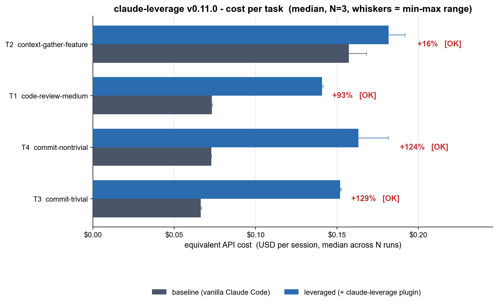
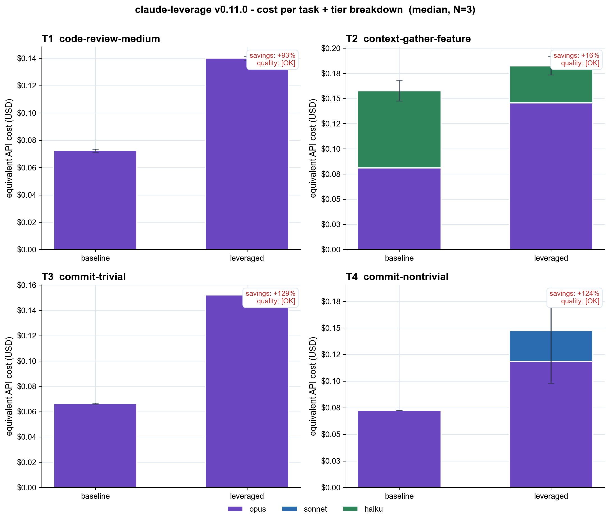

# claude-leverage benchmark - 2026-05-24_v0.11.0-cold-opus47

- Plugin version: **v0.11.0**
- Claude Code version: **2.1.89 (Claude Code)**
- Started: 2026-05-24T09:31:46Z
- Finished: 2026-05-24T09:46:28Z
- N runs per (task x condition): **3**
- Total cost (subscription tokens consumed): **$2.976**

## Headline

Median **cost** summed across 4 tasks: baseline **$0.369** -> leveraged **$0.638**  (**+73%**).

Median **tokens** summed: baseline **170.2k** -> leveraged **194.1k**  (+14%).

## Per-task breakdown

| Task | Baseline cost | Leveraged cost | Cost savings | Tokens (b -> l) | Quality |
|---|---:|---:|---:|---:|---:|
| T2 context-gather-feature | $0.157 ($0.148-$0.168) | $0.182 ($0.174-$0.192) | +16% | 35.2k -> 35.7k | [OK] |
| T1 code-review-medium | $0.073 ($0.071-$0.074) | $0.141 ($0.138-$0.141) | +93% | 34.2k -> 35.2k | [OK] |
| T4 commit-nontrivial | $0.073 ($0.073-$0.073) | $0.163 ($0.098-$0.182) | +124% | 51.2k -> 52.8k | [OK] |
| T3 commit-trivial | $0.066 ($0.066-$0.067) | $0.152 ($0.152-$0.153) | +129% | 49.6k -> 70.5k | [OK] |

## Run-by-run detail

| Cell | Tokens | Cost USD | Duration | Quality | Notes |
|---|---:|---:|---:|---:|---|
| T1__baseline__r0 | 34.1k | $0.071 | 22.4s | [OK] |  |
| T1__baseline__r1 | 34.2k | $0.073 | 23.5s | [OK] |  |
| T1__baseline__r2 | 34.2k | $0.074 | 26.8s | [OK] |  |
| T1__leveraged__r0 | 35.1k | $0.138 | 24.4s | [OK] |  |
| T1__leveraged__r1 | 35.2k | $0.141 | 25.1s | [OK] |  |
| T1__leveraged__r2 | 35.3k | $0.141 | 24.1s | [OK] |  |
| T2__baseline__r0 | 35.1k | $0.157 | 90.3s | [OK] |  |
| T2__baseline__r1 | 35.2k | $0.148 | 77.0s | [OK] |  |
| T2__baseline__r2 | 35.6k | $0.168 | 95.7s | [OK] |  |
| T2__leveraged__r0 | 35.5k | $0.174 | 54.8s | [OK] |  |
| T2__leveraged__r1 | 35.7k | $0.182 | 61.8s | [OK] |  |
| T2__leveraged__r2 | 53.7k | $0.192 | 58.6s | [OK] |  |
| T3__baseline__r0 | 49.6k | $0.066 | 13.0s | [OK] |  |
| T3__baseline__r1 | 49.7k | $0.067 | 12.4s | [OK] |  |
| T3__baseline__r2 | 49.6k | $0.066 | 12.2s | [OK] |  |
| T3__leveraged__r0 | 70.5k | $0.152 | 26.4s | [OK] |  |
| T3__leveraged__r1 | 70.7k | $0.153 | 22.8s | [OK] |  |
| T3__leveraged__r2 | 70.4k | $0.152 | 21.4s | [OK] |  |
| T4__baseline__r0 | 51.2k | $0.073 | 14.0s | [OK] |  |
| T4__baseline__r1 | 51.2k | $0.073 | 21.8s | [OK] |  |
| T4__baseline__r2 | 51.2k | $0.073 | 13.0s | [OK] |  |
| T4__leveraged__r0 | 52.8k | $0.182 | 41.4s | [OK] |  |
| T4__leveraged__r1 | 53.0k | $0.163 | 32.3s | [OK] |  |
| T4__leveraged__r2 | 52.7k | $0.098 | 32.3s | [OK] |  |

## What this does and does NOT measure

- **Measured:** real token usage and equivalent API cost (USD) from `claude -p` stream-json `result` events, in headless sessions with isolated profiles.
- **Not measured:** wall-clock end-user latency, statistical significance (N=3 is too small), realistic-suite coverage, multi-language fixtures.
- **Baseline = vanilla Claude Code** (with its built-in `Explore`, `general-purpose`, `Plan`, `statusline-setup` agents). Not 'Opus alone with no agents'.
- **Cold cache:** every session uses a fresh CLAUDE_CONFIG_DIR, so every session pays cache-creation cost. Warm-cache numbers would be lower for both conditions but not necessarily symmetrically.
- **Quality gate:** each leveraged run is checked against a deterministic regex / git assertion. A run with `FAIL` is *included* in the table but flagged; if every leveraged run fails on a task, treat the savings number with extreme skepticism.

Raw stream-json per cell: see `raw/`.