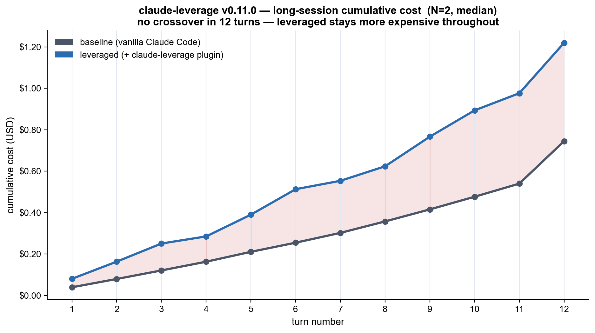
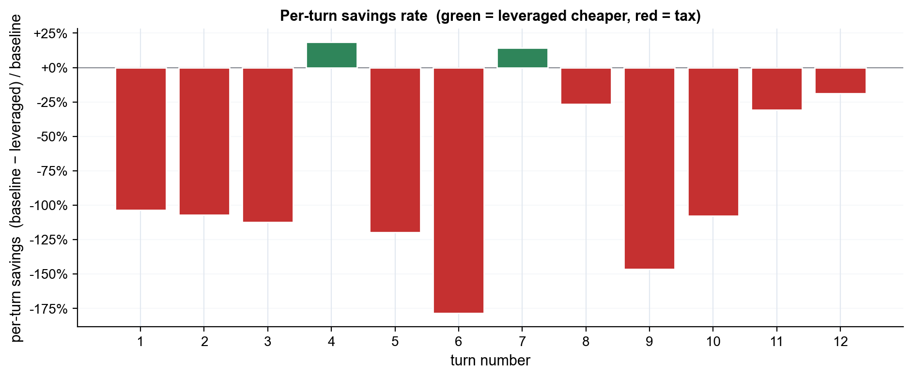

# claude-leverage v0.11.0 — long-session benchmark (2026-05-24_v0.11.0-long)

- Plugin version: **v0.11.0**
- Turns per session: **12**
- N runs per condition: **2**
- Total cost (subscription): **$3.930**

## Headline

**No crossover in 12 turns.** By turn 12, leveraged is still **$0.475 more expensive** than baseline ($1.220 vs $0.745, +64%).

To estimate when leveraged might cross over, look at the *last-half slope*: in turns 7–12, the gap changed by $+0.217. If the trend is the leveraged gap shrinking, extrapolation gives a crossover at ~turn N (calculation below).

## Per-turn detail (median across N runs)

| Turn | Prompt (preview) | Baseline cost | Leveraged cost | Cumulative B | Cumulative L | Δ cumulative |
|---:|---|---:|---:|---:|---:|---:|
| 1 | look around. what is this service? | $0.040 | $0.080 | $0.040 | $0.080 | +$0.041 |
| 2 | add a /health endpoint that returns {"status":"ok","ver… | $0.040 | $0.083 | $0.080 | $0.163 | +$0.084 |
| 3 | run the tests | $0.041 | $0.087 | $0.121 | $0.251 | +$0.130 |
| 4 | add a test for the new /health endpoint matching the ex… | $0.042 | $0.034 | $0.163 | $0.285 | +$0.122 |
| 5 | commit what we have so far using /commit-smart if avail… | $0.048 | $0.105 | $0.211 | $0.390 | +$0.179 |
| 6 | the validator module looks suspicious. review it for bu… | $0.044 | $0.123 | $0.255 | $0.513 | +$0.258 |
| 7 | fix the issues the reviewer flagged | $0.047 | $0.041 | $0.302 | $0.554 | +$0.252 |
| 8 | add a POST /users endpoint that creates a user. validat… | $0.055 | $0.070 | $0.358 | $0.624 | +$0.266 |
| 9 | write tests for POST /users covering happy path and inv… | $0.058 | $0.143 | $0.416 | $0.767 | +$0.351 |
| 10 | run all tests | $0.061 | $0.127 | $0.477 | $0.894 | +$0.417 |
| 11 | the auth module is a stub. what would real token valida… | $0.063 | $0.083 | $0.540 | $0.977 | +$0.437 |
| 12 | commit the user endpoint + tests as one commit with a g… | $0.205 | $0.243 | $0.745 | $1.220 | +$0.475 |

## Delegations observed (leveraged)

- `claude-leverage:test-runner` — 4 invocation(s) across all leveraged runs
- `claude-leverage:code-reviewer` — 2 invocation(s) across all leveraged runs
- `claude-leverage:git-committer` — 2 invocation(s) across all leveraged runs

## Methodology

- ONE `claude -p --input-format stream-json` session per cell, 12 user turns sent sequentially. Same `bench/fixtures/long-session/` cwd for all turns (Claude Code cannot change cwd mid-session).
- Turns mix: 5 Opus-inline (orientation, small edits, fixes, architectural), 5 explicit subagent delegations (`test-runner`×2, `git-committer`×2, `code-reviewer`×1), 2 hybrid (context-gather + implement).
- Cost is `result.total_cost_usd` from the final stream-json `result` event (cumulative across all turns). Per-turn approximation: total cost split proportionally to per-assistant-event token volume — exact when each turn produces one final-text event, approximate when multi-step turns (e.g. commits with multiple bash calls) produce several text events.
- Crossover detection: 1-indexed turn `N` where `cumulative_lev[N] <= cumulative_base[N]`.
