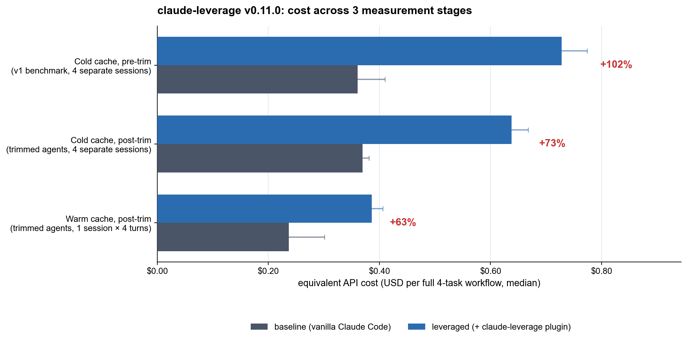

# claude-leverage v0.11.0 - combined benchmark summary

## Headline (median per full 4-task workflow)

| Stage | Baseline | Leveraged | Delta |
|---|---:|---:|---:|
| Cold cache, pre-trim (v1, 4 separate sessions) | $0.361 | $0.728 | **+102%** |
| Cold cache, post-trim (4 separate sessions) | $0.369 | $0.638 | **+73%** |
| Warm cache, post-trim (1 session × 4 turns) | $0.237 | $0.386 | **+63%** |

**Cold→warm savings (leveraged):** $0.638 → $0.386  (-39%). Cache amortization removes the plugin's per-session loading tax.

**Trim impact on cold leveraged:** $0.728 → $0.638  (-12%). Smaller agent prompts means less cache_creation tax even on cold cache.

## Per-task cold (post-trim)

| Task | Baseline | Leveraged | Delta |
|---|---:|---:|---:|
| T1 | $0.073 | $0.141 | **+93%** |
| T2 | $0.157 | $0.182 | **+16%** |
| T3 | $0.066 | $0.152 | **+129%** |
| T4 | $0.073 | $0.163 | **+124%** |

## Methodology

- **Cold-cache stages** run each task in its own headless `claude -p` session with a fresh fixture copy in `$TMPDIR` and `--setting-sources project`. 4 tasks × 2 conditions × N=3 = 24 sessions per stage.
- **Warm-cache stage** runs all 4 turns in ONE `claude -p` session via `--input-format stream-json` against a single combined fixture (`bench/fixtures/warm-session/`). Cache_read tokens after turn 1 prove the system prompt cache is reused across turns. 1 fixture × 2 conditions × N=3 = 6 sessions.
- **Trim:** agent prompts in `agents/*.md` audited and trimmed (845 → 635 lines, -25%). `context-gatherer` switched from Sonnet to Haiku based on v1 finding that baseline `Explore` (Haiku built-in) was structurally cheaper than our Sonnet context-gatherer.
- Plugin version is identical across all stages (it's the v0.10.0 plugin with v0.11 agent updates). Cost is `result.total_cost_usd` from stream-json (Anthropic's published per-model pricing applied to actual token usage).

Raw cells: `bench/results/<runid>/raw/*.session.json`.