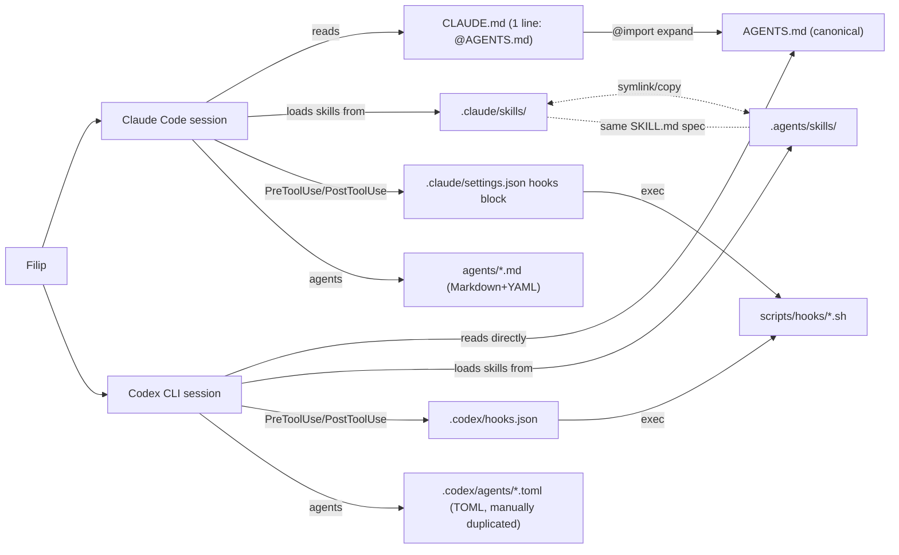

# 01 — Architecture

## Proposed top-level layout

```
claude-leverage/
├── AGENTS.md                          # canonical, tool-agnostic — Filip's stack guidance
├── CLAUDE.md                          # one line: @AGENTS.md  +  optional Claude-only block
├── README.md                          # reframed: personal dev stack, dual install sections, honest history at bottom
│
├── .claude-plugin/
│   ├── marketplace.json               # version bump → 1.0.0, new keywords/description
│   └── plugin.json                    # ditto
│
├── .claude/                           # Claude Code integration (used in the plugin's own repo)
│   ├── settings.json                  # hook config pointing at scripts/hooks/
│   └── (skills/, agents/ live at repo root for plugin install resolution)
│
├── .codex/                            # Codex integration
│   ├── config.toml                    # sandbox + [hooks] pointing at scripts/hooks/
│   ├── hooks.json                     # PreToolUse/PostToolUse/SessionStart matchers
│   └── agents/                        # TOML duplicates of the few subagents we keep
│
├── skills/                            # PRIMARY user-facing surface (cross-tool portable)
│   ├── security-review/SKILL.md       # the security audit skill
│   ├── stack-check/SKILL.md           # 30-day stack freshness check
│   ├── repo-map/SKILL.md              # generate/update mermaid C4 in README
│   ├── process-diagram/SKILL.md       # generate sequence/flowchart for a workflow
│   ├── commit-smart/SKILL.md          # migrated from commands/, now skill-form
│   └── install-snippets/SKILL.md      # migrated; updates AGENTS.md/CLAUDE.md
│
├── agents/                            # Claude-specific subagents (Markdown + YAML)
│   ├── security-reviewer.md           # Sonnet, read-only — invoked by /security-review
│   └── flaky-test-isolator.md         # the one bench-survivor that's still here for non-cost reasons
│
├── hooks/                             # Hook configuration (hooks.json)
│   └── hooks.json                     # references scripts/hooks/*.sh
│
├── scripts/                           # SHARED across Claude Code and Codex
│   ├── hooks/
│   │   ├── block-secrets-precommit.sh
│   │   ├── block-dangerous-git.sh
│   │   ├── track-delegations.sh
│   │   ├── stack-freshness.sh         # new — SessionStart 30-day nudge
│   │   └── ai-first-nudge.sh          # new — PostToolUse Write/Edit, suggests AIDEV-NOTE
│   ├── install-codex.sh               # new — Codex install (no marketplace equivalent)
│   ├── install-codex.ps1              # new — Windows variant
│   ├── sync-codex-skills.sh           # new — copies skills/ into .agents/skills/
│   └── gen-codex-agents.py            # new — generates .codex/agents/*.toml from agents/*.md
│
├── statusline/
│   ├── statusline-command.sh          # the script (currently at ~/.claude/)
│   └── README.md                      # install instructions, screenshot
│
├── stack.toml                         # declarative deps for /stack-check (Claude Code, mmdc, jq, rg…)
│
├── docs/
│   └── specs/                         # this folder (2026-05-24-pivot/ + research/)
│
├── bench/                             # KEEP — honest history
│   └── archive-token-savings-thesis/  # moved here: results/, fixtures/, harness/, retired agents
│       └── README.md                  # "this is the experiment that motivated the pivot"
│
└── CONTRIBUTING.md                    # updated workflow: how to add a skill, how to test on both tools
```

## Dual-tool topology

The research (`research_dual_codex_claude.md`) is unambiguous on the layering:



Key principles:

- **Single source of truth for guidance** = `AGENTS.md`. Both tools see the
  same instructions.
- **Hook scripts shared**, only their trigger config is duplicated. This is
  the cheap part (event names match: `PreToolUse`, `PostToolUse`,
  `SessionStart`, `Stop` — confirmed in research).
- **Skills portable by spec** (SKILL.md is the `agentskills.io` open
  standard); we use a build-time copy (Windows-friendly, no symlink admin
  rights needed) rather than a symlink. A small `scripts/sync-codex-skills.sh`
  keeps `.agents/skills/` in sync with `.claude/skills/` whenever a skill is
  added or modified — invoked from `/install-snippets` and from CI.
- **Subagents** are the unavoidable double-authoring cost: Claude wants
  `agents/*.md` (Markdown + YAML frontmatter), Codex wants
  `.codex/agents/*.toml` (TOML). Generator: `scripts/gen-codex-agents.py`
  parses `agents/*.md` and emits matching `.codex/agents/*.toml`. Run from
  `/install-snippets` and from CI.

## CLAUDE.md / AGENTS.md content split

```markdown
# AGENTS.md  (canonical — both tools read this)

## Project overview
Filip's personal Claude Code + Codex dev stack: hooks for security,
skills for workflow, conventions for AI-readable code.

## Code conventions
- AIDEV-NOTE / AIDEV-TODO / AIDEV-QUESTION anchors at non-obvious code …
- Structured logging: JSON lines with trace_id, span_id, event, attrs …
- Co-locate tests; per-directory AGENTS.md for non-trivial modules …

## Commands
- Tests: …
- Lint: …
- Build: …

## Security
- Never bypass block-secrets-precommit or block-dangerous-git hooks …
```

```markdown
# CLAUDE.md  (Claude Code adapter)
@AGENTS.md

## Claude Code specifics
- For deep refactors, use plan mode (Shift+Tab).
- Skills available: /security-review, /stack-check, /repo-map, /process-diagram, /commit-smart.
```

## Statusline integration

Current statusline lives at `~/.claude/statusline-command.sh`. It uses Python
(no jq dep on Windows), shows 5h/7d rate, context window %, model, git
branch, session cost estimate. It's already polished and Windows-tested —
we ship it as-is.

Plugin behavior:

- Plugin install copies `statusline/statusline-command.sh` to
  `~/.claude/statusline-command.sh` if and only if no statusline is already
  configured (don't overwrite custom user statuslines).
- `/install-snippets` adds the `statusLine` block to `~/.claude/settings.json`
  if not present.
- README documents how to opt out (delete the file, remove the settings
  block).

## Plugin metadata updates

```json
// plugin.json (and marketplace.json mirror)
{
  "name": "claude-leverage",
  "version": "1.0.0",
  "description": "Personal Claude Code + Codex dev stack: security hooks, AI-first code conventions, repo map, stack freshness. Designed to complement skills-based plugins like superpowers, not replace them.",
  "author": { "name": "Filip Podstavec", "url": "https://github.com/Filip-Podstavec" },
  "homepage": "https://github.com/Filip-Podstavec/claude-leverage",
  "repository": "https://github.com/Filip-Podstavec/claude-leverage",
  "license": "MIT",
  "keywords": [
    "ai-first", "security-review", "codex",
    "claude-code", "agents-md", "repo-map", "statusline",
    "stack-freshness"
  ],
  "category": "workflow"
}
```

Version 1.0.0 marks the pivot (0.x = leverage/token-savings experiment,
1.x = personal dev stack). Deliberately no `superpowers` keyword — that
collides with the well-known `obra/superpowers-marketplace` plugin which
this stack complements, not replaces.

## Open questions for review

1. **Skill vs command form for `/commit-smart` and `/install-snippets`.** The
   research shows Claude Code is moving to skill-as-command (skill with
   `disable-model-invocation: true` behaves like a slash command in both
   tools). I propose migrating both to skills for cross-tool portability.
   Acceptable, or do you want commands kept for muscle memory?
2. **Codex agent generator** (`scripts/gen-codex-agents.py`). Best-case
   produces good-enough TOML automatically; worst-case the field mapping is
   lossy and we hand-edit the TOML afterward. Should we (a) generate +
   commit, (b) generate only when explicitly asked, or (c) skip and
   hand-author the 2 subagents? I lean (a) for the 2 we have.
3. **Statusline opt-in vs opt-out on install.** Currently I propose
   "install if no statusline configured." Alternative: prompt on install.
   No real cost either way.
