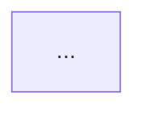

# 04 — Visualization (repo + process diagrams)

## Goal

When the user (or another agent) opens a repo using this stack, there
should be:

1. A **repo-shape diagram** in `README.md` that's accurate and
   maintainable.
2. **Process diagrams** for non-obvious workflows (how
   `/security-review` runs end-to-end, how a hook intercepts a Bash
   call, etc.), each shipped next to the relevant skill or in
   `docs/`.

Both rendered in mermaid because GitHub renders mermaid natively,
Claude Code's UI renders mermaid, the diagrams are version-controlled
text (no binary drift), and Opus 4.7 writes acceptable mermaid (with
caveats below).

## Stack decisions

- **Format:** mermaid in markdown. Specifically:
  - `flowchart` for architecture / component diagrams
  - `sequenceDiagram` for end-to-end workflows
  - `C4Context` / `C4Component` for whole-system views when useful
- **Skip:** PlantUML (requires committed PNG/SVG that drifts), D2
  (less GitHub support), Excalidraw (no code path),
  Pencil MCP (UI design, not repo diagrams — confirmed
  in `research_visualization.md`).
- **Auto-generated for deterministic things:** dependency graphs via
  `madge` (JS/TS) or per-language equivalents emit mermaid that drops
  into README. Trigger from CI when `package.json` / module structure
  changes.
- **Hand-curated for conceptual things:** the README architecture
  diagram, skill process diagrams. Reviewed on every PR that touches
  the relevant area.
- **Validation:** `mmdc` (mermaid-cli, `npm i -g @mermaid-js/mermaid-cli`)
  in optional check loop. Skill checks for `mmdc` presence; if absent,
  warns once and falls back to "trust the model."

## Skills

### `skills/repo-map/SKILL.md`

Updates the architecture mermaid block in `README.md` between markers:

```html
<!-- repo-map:start -->

<!-- repo-map:end -->
```

Behavior:

1. Walks the repo top-level + 2 levels deep.
2. Reads any `AGENTS.md` it finds (root + per-dir) for module
   descriptions.
3. Produces a `flowchart TB` with:
   - Top-level directories as nodes (grouped by category if
     `.claude-leverage.toml` declares categories).
   - Edges drawn from import graph where available (madge for JS/TS,
     a tree-sitter pass for Python — both optional).
4. Validates via `mmdc -i tmp.mmd -o tmp.svg` if mmdc is installed.
5. Replaces content between markers; leaves rest of README untouched.

Trigger: explicit `/repo-map` invocation. Auto-suggestion lives in
the docs-sync skill (`research_visualization.md` recommendation):
PRs touching `hooks/`, `skills/`, `agents/`, `scripts/` that don't
update the diagram get a nudge.

### `skills/process-diagram/SKILL.md`

Given a workflow name or description, emits a `sequenceDiagram` (for
inter-component flows) or `flowchart LR` (for decision logic), with
the option to insert it into an existing markdown file between
`<!-- process-diagram:<name>:start --> ... :end -->` markers.

Example invocations:
- `/process-diagram commit-smart` — produces sequence diagram of the
  commit-smart flow, suggests inserting into
  `skills/commit-smart/SKILL.md`.
- `/process-diagram security-review` — produces sequence diagram of
  `/security-review` end-to-end (skill → subagent → report → user
  decision).

Validation loop:
1. Generate mermaid.
2. If `mmdc` installed, run it. On error, feed error back into the
   prompt and retry up to 3 times (per
   `research_visualization.md` — known model errors: special chars in
   labels, reserved words like `end`/`class`, inconsistent arrow
   syntax).
3. Optionally render PNG and show user.

## Freshness policy

Per `research_visualization.md` two-pattern recommendation:

1. **Regenerate-from-truth in CI for deterministic graphs.**
   Dependency graphs (madge), API sequence diagrams (from OpenAPI),
   cloud topology (from Terraform / Diagrams Python). PR check
   compares committed diagram with regenerated; fails on drift.
2. **Hand-curated for conceptual.** README architecture, per-skill
   process diagrams. Stay small (≤30 nodes), reviewed every relevant
   PR.

The `docs-sync` skill (currently in `extras/`) was already designed
to flag stale diagrams. After the pivot, it migrates to `skills/docs-sync/`
and adds:
- "PR touches `skills/` / `agents/` / `hooks/` but README architecture
  block timestamp is older than the modified file" → flag.
- "PR touches `skills/<name>/` but `<name>` doesn't appear in the
  README architecture block" → flag.

These are flags for the human, not auto-fixes.

## Anti-patterns we explicitly avoid

- **Auto-generated component diagrams of the whole codebase.** They
  go noisy fast (every utility module appears, edges everywhere). The
  IcePanel writeup makes this case best: auto-component diagrams from
  code are too noisy to be useful for conceptual understanding.
- **Inline mermaid for every workflow.** Mermaid is for non-obvious
  flows. A one-step skill doesn't need a diagram.
- **Diagrams in PowerPoint / Visio / Lucidchart.** Outside the repo,
  drifts, not greppable. Hard no.

## Open questions for review

1. **How aggressive should the repo-map walker be?** I propose
   2 levels deep, grouped by category if declared. Alternative: walk
   to arbitrary depth and let mermaid's auto-layout handle it
   (becomes noisy fast on big repos).
2. **mmdc as hard dependency or optional?** Mermaid-cli requires
   Node.js + Chromium. That's heavy. I propose optional with one-time
   warning. Alternative: require it and document install. My
   recommendation: optional.
3. **Should `/process-diagram` ship a library of named templates**
   (`/process-diagram --template subagent-dispatch`) or always
   freeform? Templates ship cleaner output but limit. Recommendation:
   freeform v1.0, library v1.1 if patterns emerge.
4. **Auto-suggest on README updates.** Should `/repo-map` be
   suggested automatically by a Stop hook when the file structure
   changes meaningfully (e.g., new top-level directory)? Easy to add;
   risk of nag. Recommendation: defer to v1.1, observe behavior first.
