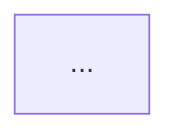

# /repo-map

## What it does

Maintains the architecture-overview mermaid block in `README.md` (or a
target file you pass). Idempotent: re-runs replace only the block between
the markers; surrounding README content is untouched.

The block:

```html
<!-- repo-map:start -->
<!-- This block is regenerated by skills/repo-map. Do not hand-edit.    -->
<!-- Re-run /repo-map to refresh after directory structure changes.     -->

<!-- repo-map:end -->
```

## Workflow

1. **Resolve target file.** Default `README.md` in the repo root. If
   `$ARGUMENTS` includes a path, use that.

2. **Resolve repo root.** Walk up from cwd looking for `.git/`. If not in
   a git repo, STOP and report.

3. **Walk the repo.**
   - Top-level: read every directory entry; skip dotfiles unless `.codex`
     or `.claude*` (those are tooling).
   - For each top-level dir, list its immediate children (2 levels total).
   - For each dir, check for an `AGENTS.md` and read its first heading +
     description (first paragraph). That becomes the node label tooltip.
   - Skip ignored paths: anything under `bench/archive-token-savings-thesis/`,
     `node_modules`, `__pycache__`, `.git`, `dist`, `build`, `.next`,
     `.pytest_cache`, `target`, `vendor`.

4. **Categorize** the top-level dirs into mermaid subgraphs:
   - `Agents & skills` — `agents/`, `skills/`, `commands/`, `.codex/agents/`
   - `Hooks & scripts` — `hooks/`, `scripts/`, `scripts/hooks/`
   - `Docs & tests` — `docs/`, `tests/`, `templates/`, `workflows/`, `*-docs/`
   - `Config` — `.claude-plugin/`, `.codex/`, `.github/`
   - `Archive` — `bench/` (shown collapsed)
   - `Other` — everything else, alphabetical

5. **Emit a flowchart** with one node per non-trivial directory. Edges go
   from a "Host (Claude Code / Codex)" node to the appropriate Agents &
   skills subgraph, and from Hooks to scripts/hooks/. Keep the diagram
   small (≤30 nodes). If the repo has many top-level dirs, group
   aggressively.

6. **Validate with mmdc if available.** Run
   `mmdc -i <tmp.mmd> -o <tmp.svg>` against the generated mermaid. If it
   errors, read the error, fix the mermaid syntax (common offenders:
   special characters in labels — wrap in quotes; reserved IDs like
   `end`/`class` — pick a different ID; inconsistent arrow syntax), and
   retry up to 3 times. If `mmdc` is not on PATH, skip validation with a
   one-line warning.

7. **Replace the block in target file.** Use `Edit` with the entire
   existing block (including both markers) as `old_string` and the new
   block as `new_string`. Both markers stay byte-identical. If the file
   has no markers yet, append the block after the first H1 heading.

## Tunables

- **Depth.** Default 2 levels deep. Pass `--depth N` to override (1–3 only).
- **Direction.** Default `flowchart TB` (top-bottom). `--lr` switches to
  left-right; useful for wide repos.
- **Target file.** Default `README.md`. Pass any markdown path as the
  first positional arg.

## Hard rules

- **Never touch content outside the markers.** The marker contract is
  load-bearing. If markers are missing, append at the end (don't try to
  splice into existing prose).
- **Never delete the markers.** Replace the block content only; preserve
  the START and END comments byte-identically.
- **If the diagram would exceed 30 nodes**, group more aggressively or
  drop the deeper level. A diagram nobody reads is worse than no diagram.
- **Stop if the repo isn't a git checkout** — the freshness story
  requires a real repo with discoverable structure.

## What this skill does NOT do

- **Module-internal flow.** That's `/process-diagram`'s job — sequence and
  workflow diagrams for specific named flows.
- **Auto-generated dependency graphs.** Use `madge` / `dependency-cruiser`
  for JS/TS, separate skills/tools for other languages. Repo-map is for
  human-readable architecture, not exhaustive import graphs.
- **Per-language file inspection.** It only walks directory structure +
  AGENTS.md hints. Reading every source file to infer architecture is
  out of scope (and would be noisy).

## When to run

- Initial setup of a new repo with this stack.
- After adding or renaming a top-level directory.
- Before tagging a release (so the README architecture is honest).
- The `docs-sync` skill (Phase 3.5 candidate) will flag PRs that change
  layout without re-running `/repo-map`.
