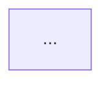

# /repo-map

## What it does

Maintains the architecture-overview mermaid block in `README.md` (or a
target file you pass). Idempotent: re-runs replace only the block between
the markers; surrounding README content is untouched.

The block:

```html
<!-- repo-map:start -->
<!-- This block is regenerated by skills/repo-map. Do not hand-edit.    -->
<!-- Re-run /repo-map to refresh after directory structure changes.     -->

<!-- repo-map:end -->
```

## Workflow

1. **Resolve target file.** Default `README.md` in the repo root. If
   `$ARGUMENTS` includes a path, use that.

2. **Resolve repo root.** Walk up from cwd looking for `.git/`. If not in
   a git repo, STOP and report.

3. **Walk the repo.**
   - Top-level: read every directory entry; skip dotfiles unless `.codex`
     or `.claude*` (those are tooling).
   - For each top-level dir, list its immediate children (2 levels total).
   - For each dir, check for an `AGENTS.md` and read its first heading +
     description (first paragraph). That becomes the node label tooltip.
   - Skip ignored paths: anything under `bench/archive-token-savings-thesis/`,
     `node_modules`, `__pycache__`, `.git`, `dist`, `build`, `.next`,
     `.pytest_cache`, `target`, `vendor`.

4. **Categorize** the top-level dirs into mermaid subgraphs:
   - `Agents & skills` — `agents/`, `skills/`, `commands/`, `.codex/agents/`
   - `Hooks & scripts` — `hooks/`, `scripts/`, `scripts/hooks/`
   - `Docs & tests` — `docs/`, `tests/`, `templates/`, `workflows/`, `*-docs/`
   - `Config` — `.claude-plugin/`, `.codex/`, `.github/`
   - `Archive` — `bench/` (shown collapsed)
   - `Other` — everything else, alphabetical

5. **Emit a flowchart** with one node per non-trivial directory. Edges go
   from a "Host (Claude Code / Codex)" node to the appropriate Agents &
   skills subgraph, and from Hooks to scripts/hooks/. Keep the diagram
   small (≤30 nodes). If the repo has many top-level dirs, group
   aggressively.

6. **Validate with mmdc if available.** Run
   `mmdc -i <tmp.mmd> -o <tmp.svg>` against the generated mermaid. If it
   errors, read the error, fix the mermaid syntax (common offenders:
   special characters in labels — wrap in quotes; reserved IDs like
   `end`/`class` — pick a different ID; inconsistent arrow syntax), and
   retry up to 3 times. If `mmdc` is not on PATH, skip validation with a
   one-line warning.

7. **Replace the block in target file.** Use `Edit` with the entire
   existing block (including both markers) as `old_string` and the new
   block as `new_string`. Both markers stay byte-identical. If the file
   has no markers yet, append the block after the first H1 heading.

8. **(Opt-in) Dependency graph block.** If `madge` (JS/TS) or `pydeps`
   (Python) is installed on PATH, generate a second mermaid block
   showing the module import graph. The block lives between separate
   markers so the conceptual architecture and the auto-generated dep
   graph are independent:

   ```html
   <!-- repo-map-deps:start -->
   <!-- Auto-generated by /repo-map from madge/pydeps. Do not hand-edit. -->
   ```mermaid
   flowchart LR
       ...
   ```
   <!-- repo-map-deps:end -->
   ```

   - JS/TS: run `madge --mermaid --extensions ts,tsx,js,jsx src/` (or
     the detected source dir). madge already emits mermaid.
   - Python: run `pydeps --no-output --show-deps <pkg>` then convert
     the JSON output to mermaid (a small Python one-liner inside the
     skill body).
   - Cap nodes at 50. If the graph is bigger, drop edges that go to
     trivially shared modules (utils, types) and add a note.
   - If neither tool is installed: skip silently. Print one line in
     the skill output: "no dep-graph tool detected (madge / pydeps);
     skipped dep block".
   - If the user passes `--no-deps`, skip even if tools are installed.

## Tunables

- **Depth.** Default 2 levels deep. Pass `--depth N` to override (1–3 only).
- **Direction.** Default `flowchart TB` (top-bottom). `--lr` switches to
  left-right; useful for wide repos.
- **Target file.** Default `README.md`. Pass any markdown path as the
  first positional arg.
- **Dep graph.** Auto-included when `madge`/`pydeps` is on PATH. Disable
  with `--no-deps`. Force the source dir with `--src <path>` (default
  auto-detect: `src/`, `lib/`, top-level `package.json`'s `main`
  directory, or top-level Python package).

## Hard rules

- **Never touch content outside the markers.** The marker contract is
  load-bearing. If markers are missing, append at the end (don't try to
  splice into existing prose).
- **Never delete the markers.** Replace the block content only; preserve
  the START and END comments byte-identically.
- **If the diagram would exceed 30 nodes**, group more aggressively or
  drop the deeper level. A diagram nobody reads is worse than no diagram.
- **Stop if the repo isn't a git checkout** — the freshness story
  requires a real repo with discoverable structure.

## What this skill does NOT do

- **Module-internal flow.** That's `/process-diagram`'s job — sequence and
  workflow diagrams for specific named flows.
- **Install madge / pydeps for you.** If absent, the dep-graph block is
  skipped — main repo-map block still ships. `/stack-check` reports
  these as optional deps.
- **Cross-language dep graphs.** A monorepo with both JS and Python gets
  one madge block OR one pydeps block, whichever's source dir is
  detected first. Multi-graph support is v1.x.
- **Per-language file inspection beyond imports.** Only directory
  structure + AGENTS.md hints feed the conceptual diagram; only imports
  feed the dep diagram. Reading every source file to infer architecture
  is out of scope (and would be noisy).

## When to run

- Initial setup of a new repo with this stack.
- After adding or renaming a top-level directory.
- After non-trivial refactoring that moves modules around.
- Before tagging a release (so the README architecture is honest).
- The dep-graph block is cheap to regenerate; the conceptual block
  almost never needs regeneration once it settles.
